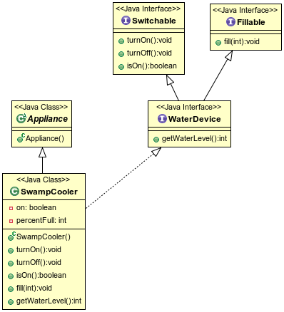

## Interface Inheritance

An interface can extend another interface.

```java
public interface Dimmable extends Switchable {
  void setIntensity(int brightnessPercentage);
  int getIntensity();
}
```

An implementing class must implement all the abstract methods of the interface and its ancestors.

```java
public class VanityLight1 implements Dimmable {
  private boolean on;
  @Override
  public void turnOn() {                     // Abstract method from Switchable
    on = true;
    System.out.println("Vanity Light on");
  }
  @Override
  public void turnOff() {                    // Abstract method from Switchable
    on = false;
    System.out.println("Vanity Light off");
  }
  @Override
  public boolean isOn() {                    // Abstract method from Switchable
    return on;
  }

  private int intensity = 100;
  @Override
  public void setIntensity(int brightnessPercentage) { // Abstract method from Dimmable
    intensity = (intensity > 100) ? 100
                                  : (intensity < 0) ? 0
                                                      : brightnessPercentage;
  }
  @Override
  public int getIntensity() {                          // Abstract method from Dimmable
    return intensity;
  }
}
```
Methods already implemented by a superclass don't have to be reimplemented.

* But if a superclass declares any `abstract` methods, you must either implement them or declare the new class `abstract`.

* Remember: when a class both `extends` a superclass, and `implements` one or more interfaces, the `extends` clause comes first.

```java
          // AbstractLight implements Switchable
public class VanityLight extends AbstractLight implements Dimmable {
  private int intensity = 100;
  @Override
  public void setIntensity(int brightnessPercentage) { // Abstract method from Dimmable
    intensity = (intensity > 100) ? 100
                                  : (intensity < 100) ? 0
                                                      : brightnessPercentage;
  }
  @Override
  public int getIntensity() {                          // Abstract method from Dimmable
    return intensity;
  }
  @Override
  public void changeBulb() {                           // Abstract method from AbstractLight
    System.out.println("Change bulb in vanity light.");
    System.out.println("Make sure new bulb is labelled \"dimmable\".");
  }
}
```

An interface can `extend` multiple parent interfaces.

```java
public interface WaterDevice extends Switchable, Fillable {
  int getWaterLevel();
}
```

Implementing classes must implement all methods of the interface and its ancestors.

```java
public class SwampCooler extends Appliance implements WaterDevice {
  private boolean on;
  @Override
  public void turnOn() {          // Abstract method from Switchable
    on = true;
    System.out.println("Swamp cooler turned on.");
  }
  @Override
  public void turnOff() {         // Abstract method from Switchable
    on = false;
    System.out.println("Swamp cooler turned off.");
  }
  @Override
  public boolean isOn() {         // Abstract method from Switchable
    return on;
  }

  private int percentFull;
  @Override
  public void fill(int amount) {  // Abstract method from Fillable
    percentFull = amount;
  }
  @Override
  public int getWaterLevel() {    // Abstract method from WaterDevice
    return percentFull;
  }

}
```

* `SwampCooler` inherits the types `Appliance`, `WaterDevice`, `Switchable`, and `Fillable`.

* A reference to a `SwampCooler` object can be safely upcast to any of these types.

  ```java
    Object obj = new SwampCooler(); // SwampCooler object in memory.

    Fillable f = (Fillable)obj;
    f.fill(90);

    Switchable s = (Switchable)obj;
    s.turnOn();

    WaterDevice wd = (WaterDevice)obj;
    System.out.println("Water level: " + wd.getWaterLevel());
  ```




### Practice Exercise
>
> * A `class` can `extend` only one superclass but `implement` many interfaces.
> * An `interface` can `extend` many other interfaces, and can't `implement` anything - that's what classes do.

[Full SmartHome UML Class Diagram](images/smartHome.png)

<hr>

[Prev](fields.md) | [Up](README.md) | [Next](staticMethods.md)

