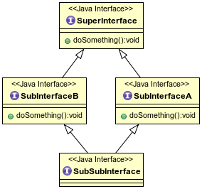

## Multiple Inheritance

In Object-Oriented languages, _multiple inheritance_ is the ability to inherit from more than one direct superclass.

* In languages that allow this, ambiguities can arise if two parent classes declare the same instance field name - which of the two parent states would the child class inherit?

* What if both parents declare the same method - which would the child class inherit?

* This is called the _Diamond Problem_ of multiple inheritance because of the diamond-shaped inheritance diagram it creates:

  

A Java class can implement more than one interface: a `CoffeeMaker` IS-A `Appliance`, IS-A `Switchable`, and IS-A `Fillable`.

* Variables of any of these types can refer to a `CoffeeMaker` object.

* Java supports multiple inheritance of _type_.<sup>1</sup>

The designers of Java chose not to allow a class to `extend` more than one superclass, so it can't have ambiguous fields from multiple parent classes.

* Java does not support multiple inheritance of _state_.

A Java interface can _extend_, and a Java class can _implement_, multiple parent interfaces.

* With `default` methods, this leads to the possibility of multiple inheritance of _implementation_.

  ```java
  interface SuperInterface {
    void doSomething();
  }

  interface SubInterfaceA extends SuperInterface {
    default void doSomething() {
      System.out.println("SubInterfaceA implementation.");
    }
  }

  interface SubInterfaceB extends SuperInterface {
    default void doSomething() {
      System.out.println("SubInterfaceB implementation.");
    }
  }

  public interface SubSubInterface extends SubInterfaceA, SubInterfaceB {

  }
  ```
  * Which `doSomething()` implementation does `SubSubInterface` inherit?

Java requires this ambiguity to be resolved before compilation - the code above will fail to compile, because of the duplicate method signatures inherited from `SubInterfaceA` and `SubInterfaceB`.

* `SubSubInterface` must override `doSomething` in order to compile, either

  * As an `abstract` method:

   ```java
   interface SubSubInterface extends SubInterfaceA, SubInterfaceB {
     void doSomething();
   }
   ```

  * With its own implementation, which can optionally invoke either of the parent implementations by qualifying `super` with the parent interface name:

   ```java
   interface SubSubInterface extends SubInterfaceA, SubInterfaceB {
     default void doSomething() {
       SubInterfaceA.super.doSomething();
       SubInterfaceB.super.doSomething();
       System.out.println("SubSubInterface implementation");
     }
   }
   ```

* The same is true for an implementing class:

  ```java
  class SubInterfacesImplementor implements SubInterfaceA, SubInterfaceB {
    public void doSomething() {
      SubInterfaceA.super.doSomething();
      SubInterfaceB.super.doSomething();
      System.out.println("SubInterfacesImplementor implementation");
    }
  }
  ```

### Practice Exercise
> Multiple inheritance issues don't come up often in Java.
>
> The main takeaway for you here is, any time interface default methods cause ambiguities, they must be resolved in the implementing class at compile time.


[1] [Multiple Inheritance of State, Implementation, and Type](https://docs.oracle.com/javase/tutorial/java/IandI/multipleinheritance.html)

<hr>

[Prev](defaultMethods.md) -- [Up](README.md) -- [Next](labs.md)

