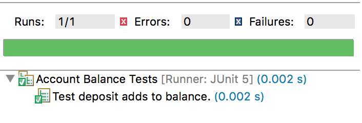

## Test Method Names
Below is the `AccountTest2` solution, with methods for setup and a single test.

```java
package com.example.junit5.solutions;

import static org.junit.jupiter.api.Assertions.fail;

import org.junit.jupiter.api.AfterEach;
import org.junit.jupiter.api.BeforeEach;
import org.junit.jupiter.api.Test;

import com.example.junit5.drills.Account;

class AccountTests2 {

  private Account account;

  @BeforeEach
  void setUp() {
    account = new Account(100);
  }

  @AfterEach
  void tearDown() {
    account = null;
  }

  @Test
  void test() {
    fail("Not yet implemented");
  }
}
```

We will add a descriptive `@Test` method to test that the `deposit` method adds to the `Account`'s balance.

```java
@Test
void test_deposit_adds_to_balance() {
  account.deposit(50);
  assertEquals(150, account.getBalance());
}
```

Rather than give the method a long name describing its behavior, we can use an annotation to state the method's purpose.

### `@DisplayName`
This annotation is placed above a class or method to describe it.
* We can use any character in the description - even emojis.

```java
@DisplayName("Account Balance Tests")
class AccountTests2 {

  // ...

  @Test
  @DisplayName("Test deposit adds to balance.")
  void testDeposit() {
    account.deposit(50);
    assertEquals(150, account.getBalance());
  }
}
```

The description displays when the test case is run.



### Practice Exercise
> NOTE: `@DisplayName` is NOT a substitute for proper method names. Every method name (not just test methods) should always be a descriptive verb or phrase.  Popular test method naming conventions include:
> * `test_FeatureBeingTested`
>   ```java
>   test_list_all_Presidents()
>   ```
> * `test_MethodName_ExpectedResult_TestCondition`
>   ```java
>   test_list_getPresident_returns_null_for_invalid_term_number()
>   ```
> * `TestCondition_MethodName_ExpectedResult`
>   ```java
>   whenTermNumber_invalid_getPresident_returns_null()
>   ```


### Drill
> `JUnit5/test/com.example.junit5.drills.AccountTests`
>
> * Change the `test` method to `testDeposit`, above, with `@DisplayName`.
>
> Make sure you import the correct `assertEquals` method, located in `org.junit.jupiter.api.Assertions`
>
> (Solution: _AccountTests3.java_)

<hr>

[Prev](before-and-after.md) -- [Up](README.md) -- [Next](assertions.md)

