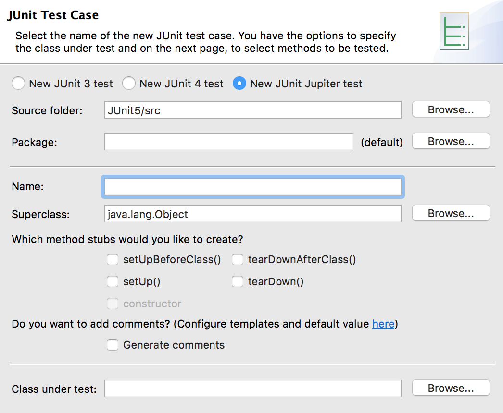

## Introduction

JUnit 5 is composed of several different modules.

* **JUnit Platform** - the foundation for running JUnit in IDEs and build tools.
* **JUnit Jupiter** - code for writing tests.
* **JUnit Vintage** - for running JUnit 3 and JUnit 4 tests.

**JUnit 5 = JUnit Platform + JUnit Jupiter + JUnit Vintage**

### Creating a Test Case
Create a test case in Eclipse with _File->New->JUnit_ Test Case (same as JUnit 4).

Choose _New JUnit Jupiter test_.

Then add JUnit5 to the build path.

### Drill
> * Create the package `JUnit5/test/com.example.junit5.drills`. Be sure to do this in the `test` source directory.
> * Create a new JUnit 5 Test Case called `AccountTests`.

[Prev](README.md) | [Up](README.md) | [Next](test.md)

