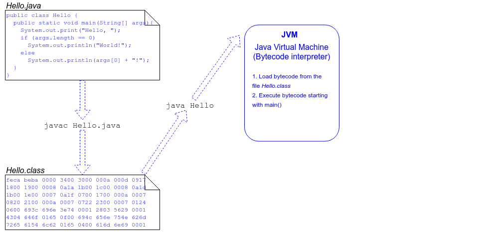
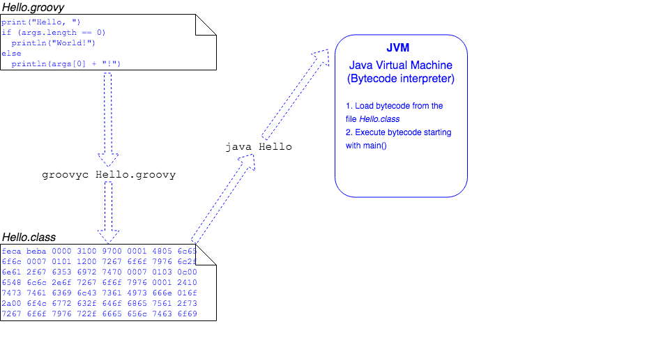

## The Java Language Specification

The rules of the Java language are defined in the [Java Language Specification](https://docs.oracle.com/javase/specs/jls/se8/html/index.html) and are enforced by the Java Compiler, `javac`.

* The output of `javac` is platform-neutral bytecode that complies with the Java Virtual Machine Specification.

The JVM doesn't know the Java language - that's the Java Compiler's job.

* It just needs valid bytecode to run.

| Specification | Specifies | Applies To |
|---------------|-----------|------------|
| Java Language Specification | How Java source code is compiled: rules of Java syntax. | `javac` - the Java Compiler |
| Java Virtual Machine Specification | How bytecode is executed | `java` - the JVM |
| Java Platform Standard Edition API Specification | How the Java libraries must be implemented | |

### Practice Exercise
> The JRE is almost ubiquitous as an execution platform.
> 
> Developers with different ideas about language structure have developed many other languages that compile to JVM bytecode.
> 
> * Clojure
> * Scala
> * Kotlin
> * Groovy
> 
> 

[Prev](jdk.md) -- [Up](README.md) -- [Next](labs.md)

