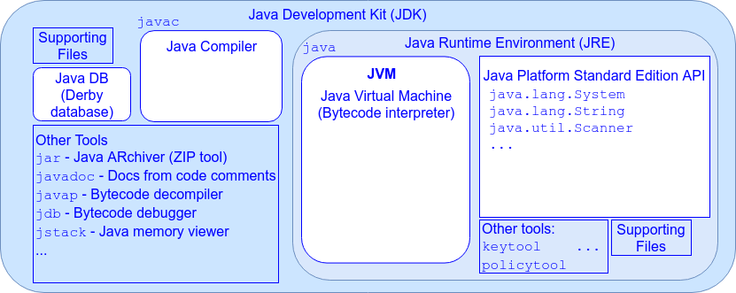

## The Java Development Kit

We use the _Java Compiler_, `javac`, to generate bytecode from Java-language source code files.

`javac` reads a source code `.java` file and produces a `.class` bytecode file.

Source code must comply with the [_Java Language Specification_](https://docs.oracle.com/javase/specs/jls/se8/html/index.html) (_JLS_) in order to compile.

* Additionally, any classes referenced by the source code must be available to the compiler.

The Java Compiler is provided with the _Java Development Kit_ (_JDK_).

The JDK includes several other features for developers:

* Java DB - a Java-based Relational Database Management System (RDBMS), derived from the Apache Derby project.

* A number of utility programs for developers including:
  * `jar` - Java ARchiver, used for packaging java projects and applications.
  * `javadoc` - generates HTML documentation from special comments you include in your code.
  * `javap` - bytecode decompiler, generates Java source from compiled bytecode.
  * `jdb` - Java debugger.
  * `jstack` - Java memory viewer/stack tracer.

[Prev](jre.md) -- [Up](README.md) -- [Next](javaSpec.md)

