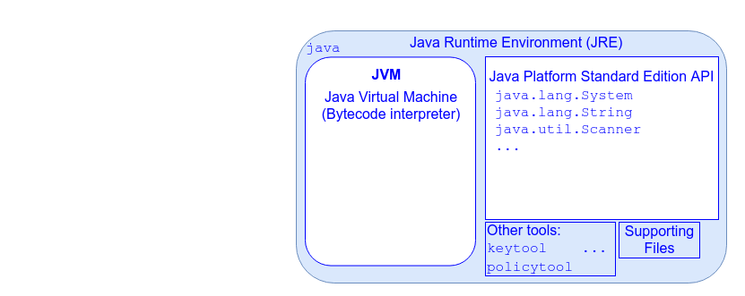

## The Java Runtime Environment

The JVM needs access to standard classes every program uses:

* `java.lang.Object`
* `java.lang.System`
* `java.lang.String`
* etc.

Your program might use additional classes from the standard Java libraries.

* `java.util.Scanner`

These standard library classes are defined in the [_Java Platform Standard Edition API Specification_](https://docs.oracle.com/javase/8/docs/api/index.html) or _Java SE_.

* Java SE defines an extensive set of classes for everything from basic programming, to file I/O, graphical application development, database access, networking, and more.

* Anyone could write their own implementations of these classes; as long as they conform to the Java SE specification, any Java program would be able to use them.

We need a JVM and the Java SE Platform in order to run a program.

The combination of JVM, Java SE Platform, and various supporting files and utilities comprise the _Java Runtime Environment_ (_JRE_).

* Anyone with a JRE installed can run a Java application.

[Prev](javaVirtualMachine.md) | [Up](README.md) | [Next](jdk.md)

