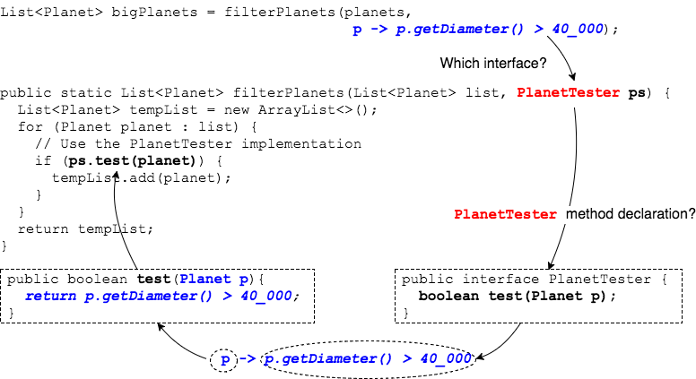

Lambdas are based on interfaces, and the compiler relies on _context_ to determine what a lambda means.

* Context is either the _variable type_ we're assigning a lambda to, or _method parameter type_ when we pass a lambda in a method call.


Consider the `PlanetTester` interface.

```java
public interface PlanetTester {
  public boolean test(Planet p);
}
```

This method takes a `List` of `Planet`s and a `PlanetTester` interface implementation.

```java
public static List<Planet> filterPlanets(List<Planet> list, PlanetTester ps) {
  List<Planet> tempList = new ArrayList<>();
  for (Planet planet : list) {
    // Use the PlanetTester implementation
    if (ps.test(planet)) {    
      tempList.add(planet);
    }
  }
  return tempList;
}
```

When we call the method and pass a lambda, Java knows we are trying to implement `PlanetTester`'s one method, `boolean test(Planet)`.

```java
List<Planet> bigPlanets = filterPlanets(planets, p -> p.getDiameter() > 40_000);
```


The compiler can map the lambda expression to `boolean test(Planet)` because `PlanetTester` is a _functional interface_.

### Functional Interface

A _functional interface_ contains only **one `abstract` method**.

* The compiler knows which method a lambda is trying to implement because there is only one to implement.

The compiler looks at the `interface` and its single `abstract` method to translate a lambda to a method.



#### `@FunctionalInterface`
We can add the annotation `@FunctionalInterface` to an `interface` to ask the compiler to generate an error if there is not exactly one `abstract` method.

```java
@FunctionalInterface
public interface PlanetTester {
  public boolean test(Planet p);
}
```


### Drill
> `Lambdas/com.example.lambdas.drills.PlanetUtilities`
>
> Add the method `filterPlanets` to `PlanetUtilities`.
>
> ```java
> public static List<Planet> filterPlanets(List<Planet> list, PlanetTester ps) {
>   List<Planet> tempList = new ArrayList<>();
>   for (Planet planet : list) {
>     // Use the PlanetTester implementation
>     if (ps.test(planet)) {    
>       tempList.add(planet);
>     }
>   }
>   return tempList;
> }
> ```
>
> `com.example.lambdas.drills.FilterPlanets`
>
> * Call `PlanetUtilities.filterPlanets` to filter the list of `Planet`s for those whose diameter is less than 40_000.
> * Print the list of small planets.

<hr>

[Prev](lambdaSyntax.md) -- [Up](README.md) -- [Next](predicate.md)

