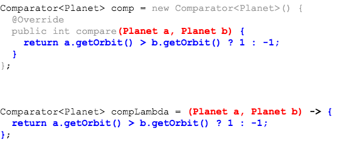

Note the similarities between the inner class and the lambda.



The lambda is just the implementation of the one method every `Comparator<Planet>` must have, `int compare(Planet, Planet)`.

### Lambdas - Purpose and Format
A lambda is the **implementation of an interface method**, but without the method name or return type.

Lambdas are identified by the arrow `->`.
* The left side is the list of method parameters.
* The right side is the method body.


```
(arguments) -> {method body}
```

### Passing Code With Lambdas
We can replace the `Comparator<Planet>` anonymous class with a lambda.

```java
package com.example.lambdas.examples;

import java.util.Collections;
import java.util.List;

public class PrintSortedPlanetsLambda {

  public static void main(String[] args) {
    List<Planet> planets = PlanetUtilities.getPlanets();

    /*
    // Passing anonymous instance
    Collections.sort(planets, new Comparator<Planet>() {
      public int compare(Planet a, Planet b) {
        return a.getOrbit() > b.getOrbit() ? 1 : -1;
      }
    });
    */

    // Passing lambda
    Collections.sort(planets,
        (Planet a, Planet b) -> { return a.getOrbit() > b.getOrbit() ? 1 : -1; } );

    for (Planet planet : planets) {
      System.out.println(planet);
    }
  }
}
```

### Drill
> `Lambdas/com.example.lambdas.drills.LambdaTranslation`
>
> In this drill you will translate inner class definitions to lambda expressions, then use the lambda as you would each inner class.

<hr>

[Prev](innerClassesAndLambdas.md) -- [Up](README.md) -- [Next](lambdaSyntax.md)

