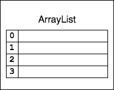
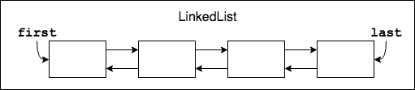
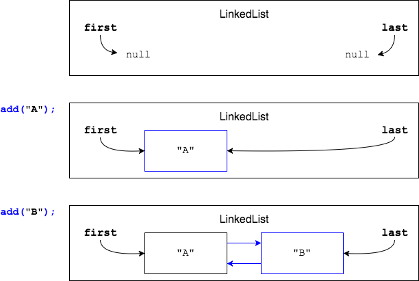
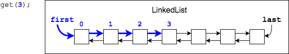

Recall that `ArrayList` maintains an internal array.

* **+** fast lookup.
* **-** the array must grow as elements are added.
* **-** elements must be shifted when elements are inserted or removed at an index.

`LinkedList` implements `List` as a _doubly-linked list_.

* The class does not maintain an internal array.
  * Each object added to the `List` is stored as a _node_, which has a reference ("link") to the next and previous node.
  * The object has a reference to its `first` and `last` nodes.

* The List starts empty, and as objects are added, nodes are added and linked to the `last` node.

### When to use `LinkedList`
`LinkedList`s are useful when an application needs to frequently **insert elements into the beginning or the end of the list**.

* **+** fast inserting at beginning (head) or end (tail).
* **-** Positional access is slower.
  * The class only has references to the head and tail, so it must start at one end and traverse node-to-node.

    

### Drill
>
> In this drill, you will run two classes which use different `List` implementation classes.
> `ListInterface/com.example.listinterface.drills.LinkedListAdding`
>
> * This class calculates the time to fill an `ArrayList` with `Planet` objects when repeatedly adding at position `0` and `size() - 1`. This causes a lot of element shifting and copying to new arrays.
>   * Run the program, and note the time taken.
>   * Change the `ArrayList` to a `LinkedList`, run, and note the difference in time.
>
>
> `ListInterface/com.example.listinterface.drills.LinkedListPositionalAccess`
>
> * This class calculates the time to access an element in an `ArrayList`.
>   * Run the program, and note the time taken.
>   * Change the `ArrayList` to a `LinkedList`, and note the difference in time.
>   * `LinkedList` should take longer because it has to start at the head or tail, then follow each reference to the previous or next node.

[Prev](list-methods.md) -- [Up](README.md) -- [Next](vector.md)

