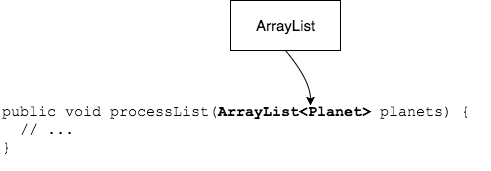
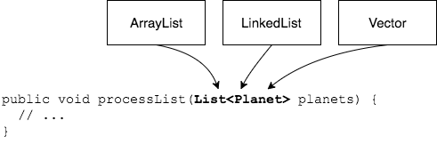

We can use the interface `List` anywhere we have used `ArrayList`, _except_ when creating an instance; then we have to create a `new` implementation class instance.

```java
// interface           new class
List<String> strings = new ArrayList<String>();
List<String> strList = new ArrayList<>();
```
## `List` as a Method Parameter
Declaring a method parameter as a `List` instead of an implementation class is important because it allows callers to pass any type of `List`.

Consider these two methods.

```java
public void processList(ArrayList<Planet> planets) {
  // ...
}

public void processList(List<Planet> planets) {
  // ...
}
```

Callers of the first method _must_ pass an `ArrayList`.
* If their code uses a different `List` implementation, converting to an `ArrayList` just to call your method is not optimal.



Callers of the second method can pass _any_ `List` implementation, so the code is more usable.





### `List` as a Return Type

Consider the `getPlanets()` method below, which creates `Planet` objects.

```java
public class Planet {
  private String name;
  private long orbit;
  private int diameter;

  public Planet(String name, long orbit, int diameter) {
    this.name = name;
    this.orbit = orbit;
    this.diameter = diameter;
  }

  @Override
  public String toString() {
    return name;
  }

  // getters and setters
}
```

```java
public class PlanetUtilities {
  public static List<Planet> getPlanets(){
    List<Planet> planets = new ArrayList<>();

    planets.add(new Planet("Mercury", 57_910_000, 4_880));
    planets.add(new Planet("Venus", 108_200_000, 12_103));
    planets.add(new Planet("Earth", 149_600_000, 12_756));
    planets.add(new Planet("Mars", 227_940_000, 6_794));
    planets.add(new Planet("Jupiter", 778_330_000, 142_984));
    planets.add(new Planet("Saturn", 1_429_400_000, 120_536));
    planets.add(new Planet("Uranus", 2_870_990_000L, 51_118));
    planets.add(new Planet("Neptune", 4_504_000_000L, 49_532));

    return planets;
  }
}
```

The method returns the type `List<Planet>`, and this has positive implications for users of this method.
* The caller can be sure that whatever object is returned will have all the `List` methods (`add`, `remove`, `get`, etc).
* The caller does not care what implementation class is used _inside_ the method.
  * It could be `new ArrayList<Planet>()` or `new LinkedList<Planet>()` - that implementation detail is hidden from callers.


## `List` as a Field or Local Variable
It is not as important to declare your field or variable type as `List`, but it is a good habit to get into.
* Declaring the type as `List` keeps you from accidentally using methods specific to the implementation class, like `LinkedList`'s `getFirst()`.
* Other developers expect this; it looks professional.

<hr>

[Prev](vector.md) -- [Up](README.md) -- [Next](labs.md)

