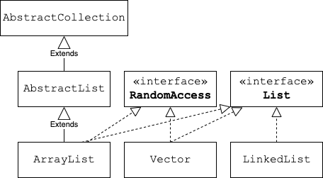

## `List` Methods

We have seen several `List` methods already:

* `int size()` - get the number of elements in the `List`.
* `boolean add(element)` - add to the end of the `List`.
* `void add(index, element)` - insert an element at the specified index.
* `E get(index)` - get element at index.
* `E set(index, element)` - replace an existing element.
* `E remove(index)` - remove an element at index.

`List` defines other useful methods.

### `boolean contains(Object)`

This method iterates through the `List`, returning `true` if the `Object` is in the `List`.

* The method calls the `Object`'s `.equals(Object)` method to compare the `Object` to each element.
* We can pass any `Object` to this method, just like we can pass any `Object` to `.equals(Object)`.

### `int indexOf(Object)`
Returns the index of the _first_ occurrence of the specified `Object` in this `List`, or `-1` if this `List` does not contain the element.
* This is like `contains(Object)` in that we can pass any `Object`, and the method calls `.equals(Object)` on the `Object` to compare it to each element.

### `boolean remove(Object o)`
This overloaded `remove` method will remove the _first_ occurrence of an `Object` from the `List`.
* It also calls `.equals(Object)` to determine which element to remove.
* It returns `true` if the `Object` was in the `List`.
* It does not return an `Object` reference because if you are passing in a reference, you already have the reference you need.

### `boolean isEmpty()`
Returns `true` if this list contains no elements.

### `boolean addAll(Collection c)`
* Add the contents of the given collection to the end of the list.

### `List subList(int start, int stop)`
* Return a new list of the elements from index `start` (inclusive) up to but not including the element at index `stop`, or to the last element if `stop` is the size of the list.

### `boolean equals(Object o)`
* This standard method inherited from `Object` is overridden for `List` so that it returns true if `Object o` is also a list of the same size, and each pair of corresponding elements are `.equals()`.

### Practice Exercise
> List implementation classes such as ArrayList, LinkedList, and Vector actually inherit the implementations of some methods from the superclasses they extend.
> Most also implement additional interfaces beyond `List`.
> 
> 

### Drill
> `ListInterface/com.example.listinterface.drills.PlanetList`
>
> * Run the program to see what Planets are already in the List of Planets.
>
> * Follow the instructions in comments to use some of the above methods on the `planets` `List`.

[Prev](list.md) -- [Up](README.md) -- [Next](linkedlist.md)

