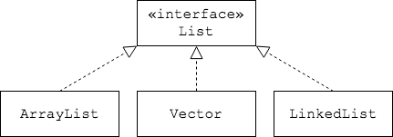

## The `List` Interface

One of the collection types defined in the `java.util` package is `List`.

* `List` is an interface.
* `List` guarantees insertion-order; the order you add elements into a list is the same order that you will iterate through them.
* `List` allows duplicate elements. (Some collections do not.)

Since `List` is an interface, we instantiate an implementing class.

* `ArrayList` is a class that implements `List`.

  ```java
  List<String> myList = new ArrayList<>();
  ```

* `LinkedList` and `Vector` are other classes that implement `List`.



<hr>

[Prev](README.md) -- [Up](README.md) -- [Next](list-methods.md)

