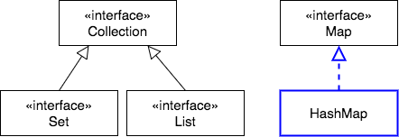
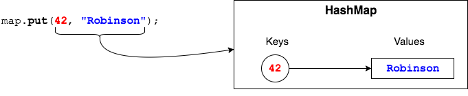
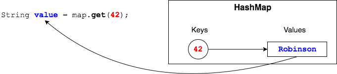
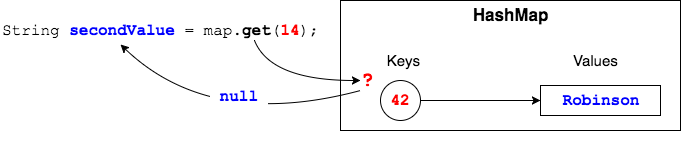
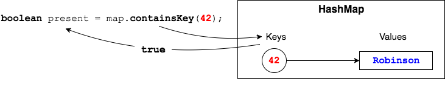
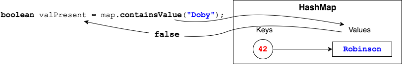

## `Map` Implementation Class - `HashMap`

To create a `Map`, we need an implementation class.




`HashMap` is the general-purpose implementation of the `Map` interface.

```java
 Map<Integer, String> map = new HashMap<>();
```


### Using the `Map`

We use `put(Integer, String)` to add data to the `HashMap`.

```java
map.put(42, "Robinson");
```




Use `get(Integer)` to get `String`s from the `Map`.

```java
String value = map.get(42);
```




If there is no mapping for a key, `get(Integer)` will return `null`.




### Key and Value Methods
`boolean containsKey(Object)` - returns `true` if the key is in the `Map`. Takes any `Object`.



`boolean containsValue(Object)` - returns `true` if the value is in the `Map`. Takes any `Object`.




### Iterating Through a `Map`'s Keys or Values

`Map` does not define an `iterator()` method.
  * `Set<K> keySet()` retrieves a `Set` of keys that you can then iterate on.

    ```java
    Set<Integer> s = map.keySet();      // Set of Integer keys
    Iterator<Integer> it = s.iterator();

    while (it.hasNext()) {
      Integer key = it.next();
      System.out.print("Key: " + key);
      System.out.println(" Value: " + map.get(key));
    }
    ```

  * `Collection<V> values()` retrieves a `Collection` of values you could iterate on.

Remember:
  * We `put` into a `Map`; we `add` to a `Set` or `List`.
  * `keySet()` returns a `Set`; `values()` returns a `Collection`.


### Practice Exercise
> Why the name _hash_ map?
>
> `HashMap` calls the `hashCode()` method of each key to evenly distribute key-value pairs in the underlying data structure (which is an array).

<br >

### Drill
> `MapInterface/com.example.mapinterface.drills.UsingHashMap`
>
> This drill has you declaring a `Map`, putting some data into it, and retrieving the data.
> * Follow instructions in the class.
> * Note the order of the key-value pairs when you iterate through the `Map`.

<hr>

[Prev](map.md) | [Up](README.md) | [Next](map-classes.md)

