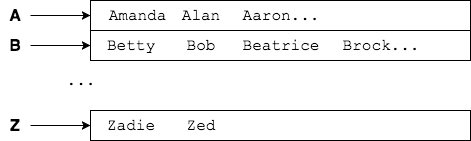

## Labs
In these labs we will use Maps to store and then retrieve data.

1. The program `com.example.mapinterface.labs.AreaCodeLister` reads in `abbreviations.txt` and `areacodes.txt`. Modify that program so that it loads the data from these files into two `HashMap`s. Then, print out each area code followed by the full name of the state or province associated with it.

   Hints:
   * Use `String.split()` to parse the key-value pairs separated by tab, `'\t'`, characters.
   * Look at the data. What values are unique, so they could be used as keys? What values are in both files?

   (Solution: _AreaCodeLister.java_)

2. Change your solution to the previous lab so that your output is sorted by area code.

   (Solution: _AreaCodeListerSorted.java_)

3. (Optional) The file `names.txt` at the root of the `MapInterface` project contains many names, but there are duplicates. We want to create a `Map` of unique names, grouped by first letter.

   

   Note that the names are not sorted in each row.

   When you have removed duplicates and separated the names, print the list of names to the screen so that each group is on a single line.

   Hints:
   * This `Map` will map `String` or `Character` keys to  `List<String>` or `Set<String>` collections, depending on your implementation.
   * `Map`s of `Collection`s use a common pattern.
     * When your application sees a letter that starts with `B`, for example, it has to check if there is a `Collection` for key `B`. If not, it creates the `Collection` and puts it in the `Map` for key `B`.
     * Then it can add the name to that `Collection`.
     * The next time it sees a `B` name, it checks for a `Collection` for key `B`, finds one, and adds the name to it.

   (Solution: _NameSeparatorMapApp.java_)

4. (Optional) Can you sort each row of names alphabetically?

[Prev](map-when.md) -- [Up](README.md)

