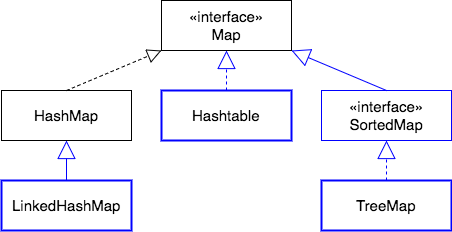

`Hashtable` is a legacy class that differs from `HashMap` in two ways:
  * `Hashtable` does not allow `null` keys.
  * `Hashtable`'s methods are `synchronized` (thread-safe, slower), while `HashMap`'s are not.

### Maintaining Key Order
Two other implementation classes will maintain an ordering of the _keys_.

`LinkedHashMap` adds ordered iteration to `HashMap`.
* The `keySet()` method will return a `Set` of keys that are in **insertion order**.

`TreeMap` implements the `SortedMap` interface.
* `TreeMap` objects are sorted based upon the key at the time of insertion and removal.
* `keySet()` returns a `Set` of **keys in ascending order**.

### Drill
> `MapInterface/com.example.mapinterface.drills.AreaCodeDrill`
>
> This drill has you use different types of `Map`s to see how keys are ordered.
> * Follow instructions in the class, in numeric order.
>   1. Add key-value pairs
>   2. Finish the `outputMapData` method
>   3. Use a `TreeMap` in `generateMapData`
>   4. Use a `LinkedHashMap` in `generateMapData`

[Prev](hashmap.md) -- [Up](README.md) -- [Next](map-when.md)

