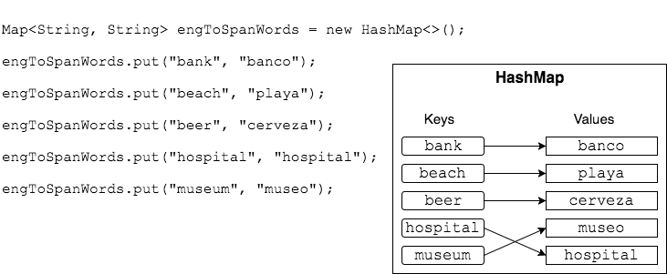
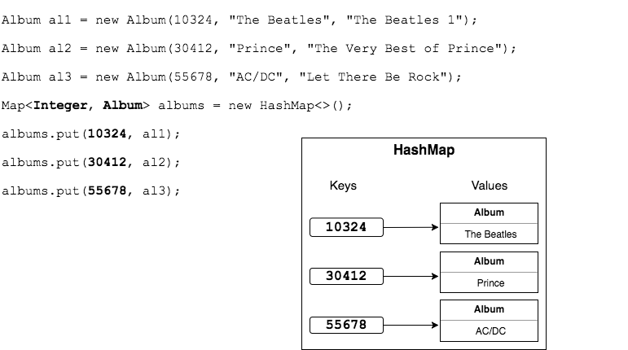
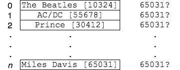
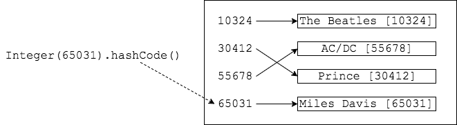

## When to Use a `Map`

The case for using a `Map` hinges on lookup: knowing something (a key) and using it to quickly find something else (a value).
  * The catch is that keys must be unique, like a social security number or account ID.

Examples:
  * Looking up a noun in one language to find its translation in another language.

    
  * Finding an object by a unique piece of data.

    

### Fast Lookup
Finding values in a `Map` is very fast.

Consider searching an unordered `List<String>` for a value.
  * We would have to start at the beginning and call `.equals()` on each element's identifying field (or the element itself).
  * The worst case is when the element is last in the `List`.
    * If there are `n` items in the `List`, we would do `n` `.equals()` comparisons.

      

With a `Map`, we simply provide the key, and are given the value.
  * The `Map` can find the key using the key's `hashCode()` and simple math operations, so it is much faster than searching a `List`.

    

### Practice Exercise
> Computer scientists call this worst-case evaluation of how long an algorithm takes _Big O Notation_ (Big "Oh" Notation).
>
> Big O is represented as a mathematical function, _O(value)_.
>
> Big O is not a measure of actual time (like nanoseconds), but how many times an algorithm has to do a set of operations relative to the size of a data set.
>
> _O(1)_ describes an algorithm that will always take the same amount of time, regardless of input data size.
> * `HashMap`'s `get` and `put` methods provide this.
>
> _O(n)_ describes an algorithm whose time to execute will grow linearly and in direct proportion to the size of the input data.
> * Searching an unordered `List` requires, worst-case, _n_ comparisons, so we say it is _O(n)_.
>
> Searching using a nested `for` loop would be _O(n) * O(n)_, or <em>O(n2)</em>.

[Prev](map-classes.md) | [Up](README.md) | [Next](labs.md)

