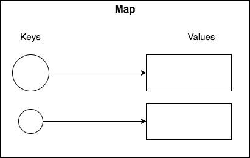
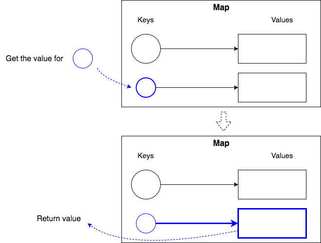
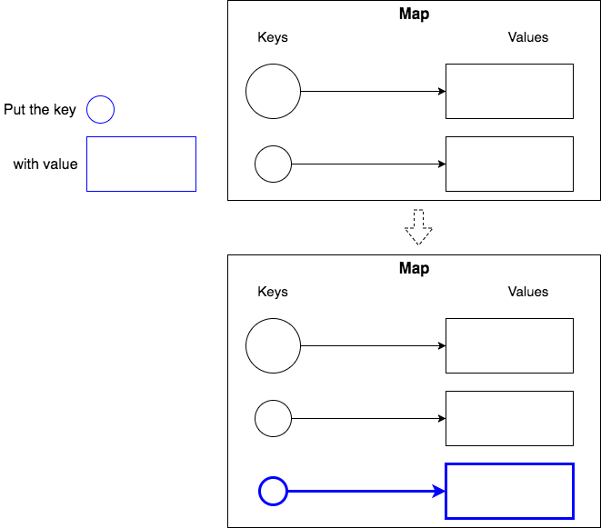
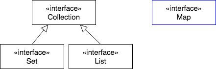
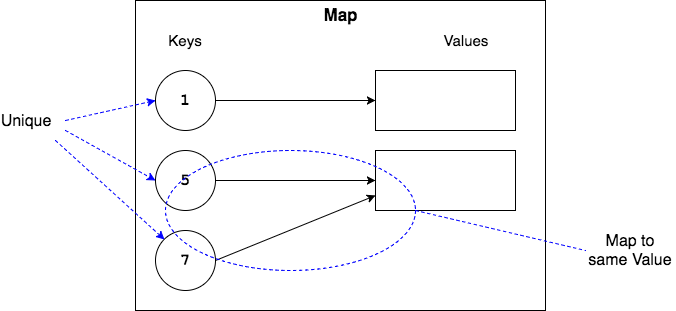

`Map` is a data structure that allows you to store key-value pairs.
* Each key refers to a value, like in a dictionary.
  * `word` --> `definition`



We get a _value_ from the map by providing the _key_.





We put a _value_ into the map with its _key_.



### `Map` and `Collection`
`Map` is part of the Java Collections Framework, but it is **not** a subinterface of `Collection`.



### Keys and Values
* The key must be unique.
* A key can map to only a single value.
* Multiple keys can map to a single value.



### `Map<K, V>`
As with `Set` and `List`, we tell a `Map` what the types of its keys and values will be.

```java
Map<Integer, String> map;   // A Map of Integer keys and String values
Map<Integer, Album> albums; // A Map of Integer keys and Album values
```

### `Map` Methods
`V put(key, value)` - adds a key-value pair to the `Map`, and returns the old value associated with this key (or `null` if there was no mapping).

`V get(key)` - returns the value associated with the given key (or `null` if this map contains no mapping for the key).

`boolean containsKey(key)` - returns `true` if the key is in the `Map`.

`boolean containsValue(value)` - returns `true` if the value is in the `Map`.

<hr>

[Prev](README.md) -- [Up](README.md) -- [Next](hashmap.md)

