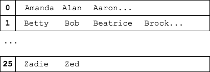

We will build an application to read a list of names, remove duplicate names, and group the names by first letter.

### Setup
Create a new Java Project called _NameSeparatorApp_. Copy `names.txt` from the _SetInterface_ project, and place it in the root of your new project.

### Functionality
We want to use `names.txt` to create a `List` of unique names, grouped by first letter.

Note that the names are not sorted in each row.

### Output
When you have removed duplicates and separated the names, print the list of names to the screen so that each group is on a single line.

### Hints
* To figure a name's index, remember that each letter has an ASCII value.
* The type of this `Collection` will be `List< Set<String> >` or `List< List<String> >`, depending on your implementation.
* `Collection`s of `Collection`s use a common pattern.
   * When your application sees a letter that starts with `B`, for example, it has to check if there is a `Collection` at index `1` for those names. If not, it creates the `Collection` and sets it at index `1`.
   * Then it can add the name to that `Collection`.
   * The next time it sees a `B` name, it checks for a `Collection` at index `1`, finds one, and adds the name to it.

(Optional) Can you sort each row of names alphabetically?

[Up](../README.md)
