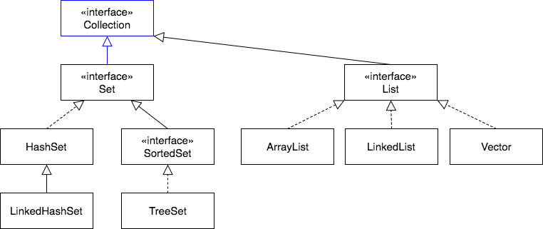

## `Collection` Superinterface
`Collection` is the parent interface of `Set` and `List`.
  * `Set` describes a group of _unique_ elements.
  * `List` describes an _ordered_ group of elements.

These interfaces are part of the _Java collections framework_.

> #### Java collections framework
> Interfaces and classes related to collections make up the Java Collections Framework.
>
> A collection is an object that contains other objects.
> * The size of a collection can be altered after creation.
> * Some collection types order elements, while others do not.

Many of the `Set` and `List` methods are declared in `Collection`.
* `boolean add(E)`
* `boolean contains(Object)`
* `Iterator<E> iterator()` - `List` has this, too.
* `boolean remove(Object)`
* `int size()`

One very useful method that all `Collection`s have is `addAll`.
* `boolean addAll(Collection)` - adds all elements from the input `Collection` to this `Collection`.
  * Returns `true` if this collection (the one the method is being invoked on) changed as a result of the call.

### Drill
> `SetInterface/com.example.setinterface.drills.CollectionTest`
>
> In this drill you will be using a `Collection` variable with a `List` and `Set` implementation class to see how `addAll()` works.
> * Follow the instructions listed in `CollectionTest.java`.

 

### Practice Exercise
> If you want to remove duplicates from a `List`, give it to a `HashSet` through either `addAll(Collection)` or the `HashSet`'s one-arg constructor, `HashSet(Collection)`.

[Prev](sortedset-treeset.md) -- [Up](README.md) -- [Next](labs.md)

