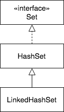

## `Set` Implementation Classes - `HashSet` and `LinkedHashSet`

To create a `Set`, we need an implementation class.




`HashSet` is a general-purpose implementation of the `Set` interface.
* A `HashSet` contains unique objects whose order is not guaranteed.
* The `hashCode()` and `equals()` methods work in combination to ensure that only unique objects are in the set.

The class below represents an `Album`, with `equals` and `hashCode` methods.

```java
package com.example.setinterface.examples;

public class Album {
  private int id;
  private String artist;
  private String title;

  public Album(int i, String a, String t) {
      id = i;
      artist = a;
      title = t;
  }

  @Override
  public String toString() {
      return "Album [id=" + id + ", artist=" + artist + ", title="
              + title + "]";
  }

  @Override
  public int hashCode() {
      final int prime = 31;
      int result = 1;
      result = prime * result
              + ((artist == null) ? 0 : artist.hashCode());
      result = prime * result + id;
      result = prime * result
              + ((title == null) ? 0 : title.hashCode());
      return result;
  }

  @Override
  public boolean equals(Object obj) {
      if (this == obj)
          return true;
      if (obj == null)
          return false;
      if (getClass() != obj.getClass())
          return false;
      Album other = (Album) obj;
      if (artist == null) {
          if (other.artist != null)
              return false;
      }
      else if (!artist.equals(other.artist))
          return false;
      if (id != other.id)
          return false;
      if (title == null) {
          if (other.title != null)
              return false;
      }
      else if (!title.equals(other.title))
          return false;
      return true;
  }
}
```

Duplicate `Album`s are created, and we attempt to store them in a `HashSet`.

```java
package com.example.setinterface.examples;

import java.util.HashSet;
import java.util.Iterator;
import java.util.Set;

public class SetTest {

  public static void main(String[] args) {
    SetTest st = new SetTest();
    st.launch();
  }

  public void launch() {
    Album al1 = new Album(1, "The Beatles", "The Beatles 1");
    Album al2 = new Album(2, "Prince", "The Very Best of Prince");
    Album al3 = new Album(3, "AC/DC", "Let There Be Rock");
    Album al4 = new Album(3, "AC/DC", "Let There Be Rock");

    Set<Album> albumCollection = new HashSet<>();

    // Add all Albums
    albumCollection.add(al1);
    albumCollection.add(al2);
    albumCollection.add(al3);
    albumCollection.add(al4);  // duplicate Album

    printAlbums(albumCollection);
  }

  private void printAlbums(Set<Album> collection) {
    Iterator<Album> it = collection.iterator();  // Get Iterator object
    while (it.hasNext()) {
      System.out.println(it.next());
    }
  }
}
```

### Drill
> `SetInterface/com.example.setinterface.drills.SetTest`
>
> * Place each call to `add` in a `System.out.println()` and run the application.

### `LinkedHashSet`
`LinkedHashSet` extends `HashSet`.
  * `LinkedHashSet` guarantees that the order of iteration will be insertion-order.
    * `HashSet` makes no guarantee about order.

### Drill
> `SetInterface/com.example.setinterface.drills.SportsTeamApp`
>
> * Change `addTeam()` to add the object to the `Set`.
> * Iterate through the contents of the `Set`.
> * If the results are not as expected, fix `SportsTeam`.
>
>   (Solution: _SportsTeamApp.java_)
> * Change `SportsTeamApp` so that the `Set` is a `LinkedHashSet`, and run the program again.
>
>   (Solution: _SportsTeamApp2.java_)

<hr>

[Prev](set.md) -- [Up](README.md) -- [Next](iterator.md)

