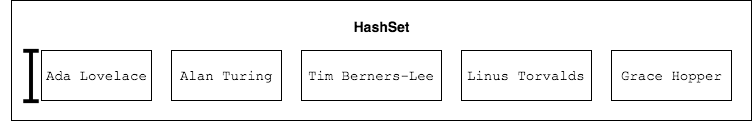
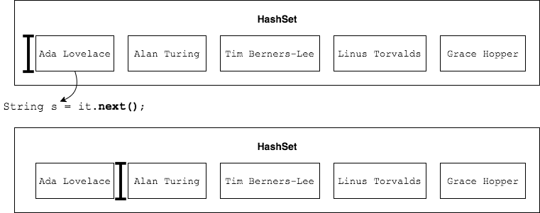

`Iterator` is a sort of helper object that `Set` provides.

```java
Set<String> strSet = new HashSet<>();
strSet.add("Ada Lovelace");
strSet.add("Linus Torvalds");
strSet.add("Alan Turing");
strSet.add("Tim Berners-Lee");
strSet.add("Grace Hopper");

Iterator<String> it = strSet.iterator();
```

We can imagine `Iterator` like a cursor on a screen that sits at the first element in the collection.




Calling `hasNext()` says whether the cursor is sitting at an element.

```java
while(it.hasNext()) {
  // ...
}
```

`next()` returns the element and advances the cursor.

```java
while(it.hasNext()) {
  String s = it.next();
  // ...
}
```




Note: we _must_ call `next()` to advance the cursor, or risk an infinite loop.


```java
while(it.hasNext()) {
  System.out.println(it.hasNext()); // Bug: should have called next() here.
                                    // Always true, always prints true.
}
```

<hr>

[Prev](hashset-linkedhashset.md) -- [Up](README.md) -- [Next](sortedset-treeset.md)

