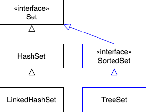

`SortedSet` is a subinterface of `Set`, which guarantees that its elements will be **ordered**.

### `SortedSet` Methods
`SortedSet` adds two important methods, since it is ordered.

* `E first()` - returns the first (lowest) element currently in this set.
* `E last()` - returns the last (highest) element currently in this set.

### `TreeSet` Implementation Class
`TreeSet` orders elements according to their _natural ordering_.

> #### natural ordering
> An ordering built into a class (in a method) so that instance _A_ can compare itself to instance _B_ to determine if it is _less than_, _equal to_, or _greater than_ instance B.
>
> For example, the natural ordering of `Integer` is smallest to largest, because every `Integer` object can look at another `Integer` object and determine whose number is larger.

 

### Practice Exercise
> `TreeSet` must maintain ordering as objects are added, so it has to compare the new object to current objects to determine where the new one goes.
>
> These comparison operations cost time, so make sure you have a reason to order elements before choosing to use `TreeSet`.

[Prev](iterator.md) -- [Up](README.md) -- [Next](collection.md)

