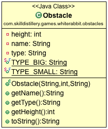
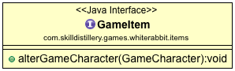
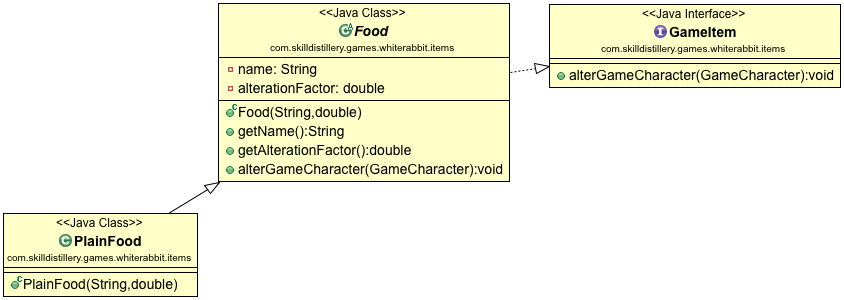
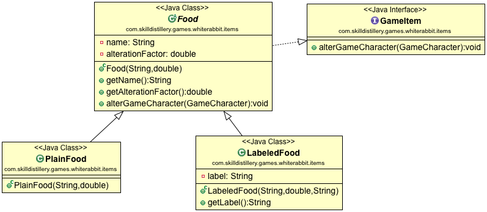
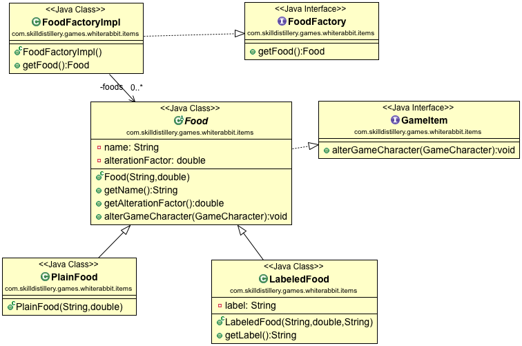
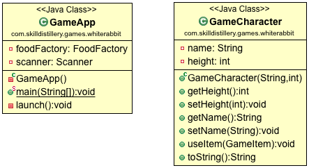

The most successful video games are those with short-, medium-, and long-term goals.

We will be coding a game with the short term goal of getting past an Obstacle.

### Story
In the context of a story (which you will create), the character will be presented with an Obstacle. The character's height is either too big or too small for the height of the Obstacle, so the character must interact with food to change their height.

### Obstacles and Food
The user can try to move the character past a single obstacle.
* To move past a `SMALL` Obstacle, the character's height must be less than or equal to the Obstacle's height.
* To move past a `BIG` Obstacle, the character's height must be greater than or equal to the Obstacle's height.


The user will be presented with food, and can choose whether the character will eat it.
  * If the character does not eat the Food, the food is discarded.
  * If the character eats the Food, the Food alters the character's height.

When the character's height is adequate, the character can move past the Obstacle, and the game ends.


### Gameplay
The user is prompted for a character name, and is then able to choose actions from a menu.

```
What is your name?
Alice
What would you like to do?
1. Examine your surroundings.
2. Look around for help.
3. Move.
4. Quit.

```

Examining surroundings displays data about the character and the obstacle.

```
Your choice:
1

You are Alice and your height is 10.
You are standing in a field. Before you is a door which appears to be 5 SMALL.
What would you like to do?
1. Examine your surroundings.
2. Look around for help.
3. Move.
4. Quit.
```

When the user looks around for help, `Food` is presented, and the game enters a submenu.

```
Your choice:
2

You see a Cake.
It says EAT ME.
What do you do?
1. Examine it.
2. Eat it.
3. Ignore it.
Your choice:
```

If the user ignores the `Food`, it is no longer usable.
* The supply of `Food` in the game is limited.

If the user eats the food, it alters the character, and the character is presented with the main menu.

```
2
You decide to try the Cake.
You're bigger!
What would you like to do?
1. Examine your surroundings.
2. Look around for help.
3. Move.
4. Quit.
Your choice:
```

The user can attempt to move, but success depends on the character's height.

```
3
You attempt to traverse the door.
But your height is 20!
What would you like to do?
1. Examine your surroundings.
2. Look around for help.
3. Move.
4. Quit.
Your choice:
```

(Note: This is just an example, and could use improvements. For example, how much bigger did the Cake make the character? Why wasn't the user able to traverse the door? These are good things to explain to a user.)

### Classes
Descriptions of the game's classes are below, with UML diagrams.

#### Obstacle
An `Obstacle` has a `name`, `height`, and `type`. `type` is either `BIG` or `SMALL`.

This class is provided in the `com.example.games.whiterabbit.obstacles` package.

A UML diagram for the Obstacle is below.




#### `Food` and `GameItem`s
`GameItem` can alter the character via its `alterGameCharacter(GameCharacter c);` method.



`Food` is a type of `GameItem`. It is `abstract`, and `Food` alters the character's `height` by using its `alterationFactor`.
* The basic implementation of `Food` is `PlainFood`.





`LabeledFood` is a specialization of `Food` which allows it to have a label (e.g. "EAT ME", "DRINK ME").
* If the game is going to attempt to read a label, it must check if the `Food` is a  `LabeledFood` (using the `instanceof` operator).



#### `FoodFactory`
`FoodFactory` is an interface for getting `Food`. The game engine will not create `new` `Food` items. Instead, it requests them from the `FoodFactory`.

`FoodFactoryImpl` _HAS-A_ `List<Food>` named `foods`.
* This object should be initialized with 8 to 10 `Food` items of various degrees of character alteration.
* The `FoodFactoryImpl` can run out of food. When the `FoodFactory` has no more food, there is nothing left to do, and the game ends.


The entire UML diagram is below.



* The `GameItem` and `Food` classes are provided for you.
* The `FoodFactory` interface is provided for you.
* TODO: Complete `Food`.
* TODO: Build the remaining classes in the `items` package.

#### `GameCharacter` and `GameApp`
The `GameCharacter` class is simple. Its most complex method is `useItem`, where it must interact with a `GameItem`.
* Look at `GameItem`'s method for changing a `GameCharacter`.

`GameApp` is the game engine, so it contains logic for managing the game. It handles gameplay events, like getting `Food` from the `FoodFactory`, and printing menus or getting input.





* The `GameCharacter` is provided for you.

* TODO: Create `GameApp`. Initialize its fields in `launch()`, and then build in small steps.
  * Start with asking the character's name, and creating a `GameCharacter` object.
  * Then print menus and accept input (with `scanner.nextLine()`).
  * Add the game logic, such as displaying a submenu and attempting to move past the obstacle.

* TODO: Test functionality.

### Where to Start?
Build out the `Food`-related classes and interfaces from the UML diagram.

Then you can build `GameApp` according to the UML diagram, and then add game logic.
* Review the gameplay example above to understand the progression of the story.


### Where to Go?
Despite all the classes, there is not much functionality. If you have time, try stretch goals.

#### Stretch Goals
1. Can you implement an inventory? `GameCharacter` would need a way to take an item, then choose which item to use.
1. Multiple obstacles?
1. A weapon system to alter Obstacles?
1. Enemies?
1. Why `height`? Isn't that more of a `level` for things in the game?
1. A story that branches?

<hr>

[Up](../README.md)
