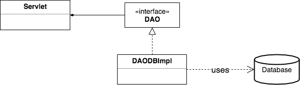
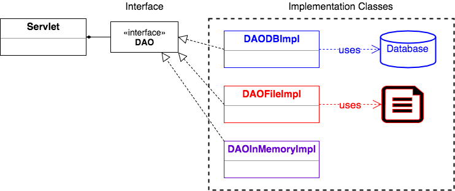

### Data Access Objects

A Data Access Object, or _DAO_, is an object that provides access to some kind of persistent storage, like a file or database.
* The DAO provides specific functionality (methods) without exposing details of what the methods do (like read a file, or store rows in a database).

DAO is an example of a _design pattern_.

> #### design pattern
> A general and repeatable solution to a problem in software design.

The DAO handles all data access and manipulation.

We call the DAO a "layer of abstraction" because our code only interacts with the DAO class to perform any data manipulation.
* The DAO manages storing and retrieving the data; the details of how it does so are hidden from whatever uses the DAO.

### DAO Example
Previous versions of `StockServlet` used a `StockProvider` class, and then manipulated the data it provided.

```java
public class StockServlet extends HttpServlet {
  private StockProvider stockProvider;

  // ...
  private Stock findStockBySymbol(List<Stock> stocks, String symbol) {
    Stock s = null;
    for (Stock stock : stocks) {
      if(stock.getSymbol().equals(symbol)) {
        s = stock;
        break;
      }
    }
    return s;
  }

  // ..
  @Override
  public void doGet(HttpServletRequest req, HttpServletResponse resp) throws ServletException, IOException {
    String symbol = req.getParameter("symbol");
    List<Stock> stocks = stockProvider.getAllStocks();
    Stock s = findStockBySymbol(stocks, symbol);

    // Do something with the stock...

    //...
  }
}
```

For better encapsulation, the new `StockServlet` leaves all data access to the DAO.
* Data access is solely the DAO's responsibility.

```java
public class StockServlet extends HttpServlet {
  private StockDAO stockDAO;

  @Override
  public void init() throws ServletException {
    stockDAO = new InMemoryStockDAOImpl();
  }

  @Override
  public void doGet(HttpServletRequest req, HttpServletResponse resp) throws ServletException, IOException {
    String symbol = req.getParameter("symbol");
    Stock s = stockDAO.findStockBySymbol(symbol);
    // ...
  }
}

```

### DAO Interface
In the diagram below, we see that the servlet has an instance of a DAO interface.
* This is common and recommended: use a DAO interface.


For example, a servlet may have a DAO that uses a database.



When a class uses an interface, we can make it use any implementation of the interface, and the class does not have to change.

The servlet does not know which implementation class it uses, only that it calls interface methods.




> ### Practice Exercise
> Some people pronounce the word "dow," while others say each letter: "D, A, O."

<hr>

[Prev](README.md) -- [Up](README.md) -- [Next](dao-implementation.md)

