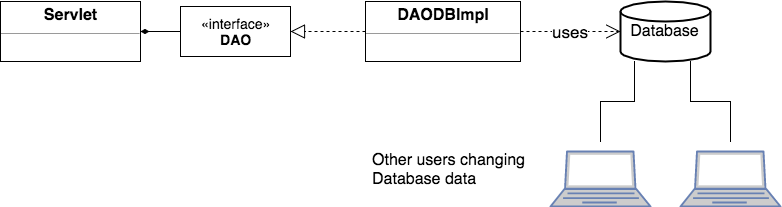
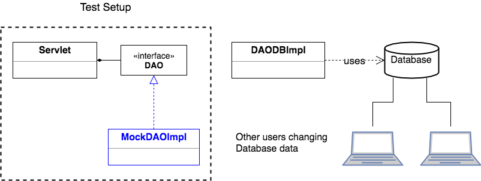

## Mock Objects for Testing

Systems can quickly become complex, with objects depending on many other objects.

Often we need to test an object that depends on another complex object.
* For example, testing a servlet that uses a DAO that uses a database - which other users may change.

If other users change data, our tests could fail.

We solve this issue by making the object we want to test use a _mock object_ during testing.

### Mock Objects
A mock object is a class we create and instantiate specifically for our tests, with a controlled set of data.
* We give the object we're testing a mock object instance so we know exactly what data its methods use.

By using a known, limited set of data, we are _isolating_ the object we want to test.
* We have confidence we're testing what the class does, not what the object it uses does.

### A Typical Mock Object
`InMemoryStockDAOImpl` has most of the characteristics of a mock object:
* Small dataset.
* Does not depend on other parts of the system.
* We know exactly what it will do when we call its methods.

We most often use mock objects in JUnit tests, and put them in the same directory as the class that uses them.

> ### Drill
>
> This drill uses a mock object to test a class.
> * The class is not a servlet, but still has a dependency that could affect testing.
>
>
> `DAOPattern/src/com.example.daopattern.drills.PresidentProcessor`
>
> The `PresidentProcessor` class has two methods we need to test:
> * `List<President> filterByParty(String string)`
> * `List<President> filterByLastName(String string)`
>
> Both methods use data from a `PresidentDAO`.
>
> In this drill, you will create
> * A mock object with minimal data.
> * JUnit tests for `PresidentProcessor`'s methods using the mock data.
>
> `DAOPattern/test/com.example.daopattern.drills`
> * Create a class named `MockPresidentDAO`, which implements `PresidentDAO`.
> * In its `getPresidents` method, return an `ArrayList` containing three presidents.
>   * `new President(1, null, null, "C", 0, null, "Dems");`
>   * `new President(2, null, null, "AAA", 0, null, "Whig");`
>   * `new President(3, null, null, "AAA", 0, null, "Whig");`
>
>   These Presidents have a unique identifier (termNumber), and a lastName and party, since that's all `PresidentProcessor` uses. The rest of the fields are `null` or `0`.
>
>  `DAOPattern/test/com.example.daopattern.drills.PresidentProcessorTests`
>
> * The `PresidentDAO` in `setUp()` is `null`. Instantiate an instance of `MockPresidentDAO`.
> * Create the tests according to the instructions. The tests must be based on the mock object's data (which you know because you created it in the `MockPresidentDAO` class).
>
> (Solution: _test/com.example.daopattern.solutions.MockPresidentDAO_, _test/com.example.daopattern.solutions.PresidentProcessorTests_)

[Prev](changing-implementation.md) | [Up](README.md)

