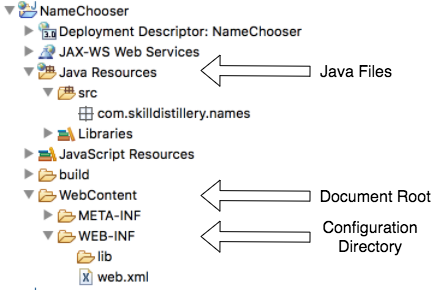
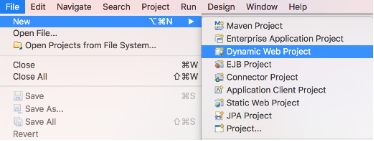
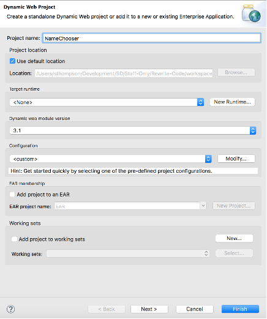
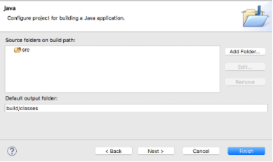
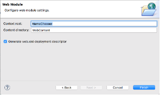

Eclipse provides the _Dynamic Web Project_  template for creating projects.
* A Dynamic Web Project can run on Eclipse's Tomcat server.

This project has a different structure than a _Java Project_.

* `Java Resources/src` - location of Java code.

* `src/main/webapp/` - document root, where Tomcat looks for files.

* `src/main/webapp/WEB-INF/` - location of `web.xml`; directory is not available outside web container.

### Creating a Dynamic Web Project.

Creating a Dynamic Web Project is much like creating a Java Project, with additional configuration steps.

* _File->New->Dynamic Web Project_. (You may have to select _Other_ and search for this type.)

  

* Give the project a name.

  

* Use default settings:
  * Project location: use default location.
  * Dynamic web module version: _3.1_.
  * Target runtime: `<none>`.
  * Configuration: `<custom>` or Default Configuration.

  Select _Next >_ to move to another configuration screen.

* Leave the source folder for Java classes as _src_, and select _Next_.

  

* Leave the content directory as _src/main/webapp_, and select _Generate web.xml deployment descriptor_. This creates the `web.xml` file.

  

  Select _Finish_.

> ### Drill
> Create a new Dynamic Web Project called _MyHelloWorld_. We will add to this project throughout the chapter.

[Prev](README.md) -- [Up](README.md) -- [Next](maven.md)

