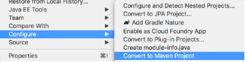

## Maven Dependencies

We can use Maven to manage our Java dependencies.
* `HttpServlet` is not a core Java library, so we have to get its class files.

Convert the project to a Maven project by right-clicking the project name and selecting _Configure->Convert to Maven Project_.



Choose the defaults and select _Finish_.

This creates the _pom.xml_ file. Open it and select the lower _pom.xml_ tab to view the source of the file.

After the closing `</build>` add the servlet API dependencies.

```xml
<dependencies>
	<dependency>
		<groupId>javax.servlet</groupId>
		<artifactId>javax.servlet-api</artifactId>
		<version>3.1.0</version>
	</dependency>
</dependencies>
```

You now have the code necessary to create servlets.

> ### Drill
> `MyHelloWorld`
>
> Convert your project to use Maven, and add servlet api dependencies to the _pom.xml_.

<hr>

[Prev](dynamic.md) -- [Up](README.md) -- [Next](servlet.md)

