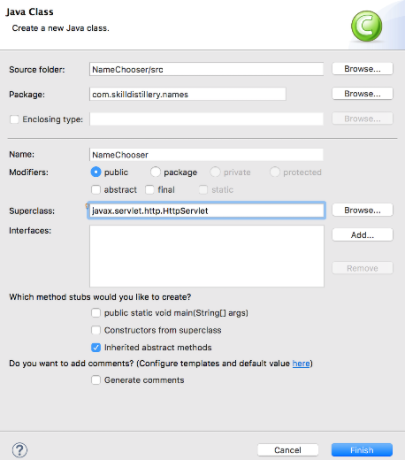

## Servlets and `web.xml`

Now that you have the servlet-api code, you can create a servlet.

* _File->New->Class_

  Superclass `javax.servlet.http.HttpServlet`

  


(Note: there is an option for _File->New->Servlet_, but that has more configuration than we want.)


### `web.xml` Configuration
Eclipse generated a default `web.xml`.

#### `<welcome-file-list>`
The `<welcome-file-list>` tag tells the web container to look for files it can serve when the user does not specify a file.
* If the user visits `http://myExample.com` instead of `http://myExample.com/something.html`, the web container will try URLs from the list of welcome files.
  * If none of these files are found, server returns a 404 error.
  * These URLs could even be a servlet's URL mapping, but without a leading `/`.

    ```xml
    <welcome-file-list>
      <welcome-file>hello</welcome-file>
    </welcome-file-list>
    ```
* Remove all lines inside `<welcome-file-list>` except `index.html`.


#### Configuring the Servlet
The final step is to add your servlet and mapping to `web.xml`, before `</web-app>`.

```xml
<servlet>
  <servlet-name>myServlet</servlet-name>
  <servlet-class>com.example.dynamic.MyServlet</servlet-class>
</servlet>
<servlet-mapping>
  <servlet-name>myServlet</servlet-name>
  <url-pattern>/hello</url-pattern>
</servlet-mapping>
```


> ### Drill
> * Create the servlet `com.example.servlets.MyHelloServlet`.
>   * Override the `doGet` method, and return an HTML document containing the word `Hello`.
> * Map the servlet to the URL `/hello`.
> * Set the welcome file to `hello.`
> * Run your application on Tomcat with _Run As->Run On Server_.

<hr>

[Prev](maven.md) -- [Up](README.md) -- [Next](labs.md)

