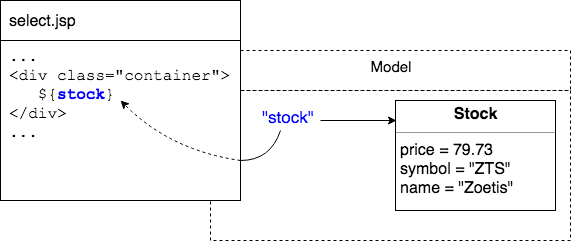

## JSP Data Model
The JSP can display data that has been added to its _model_.

> #### model
> Think of this as a container of data the JSP can access.
>
> Data is often added by a servlet before forwarding to a JSP.
>
> (This is not the "model" in MVC.)

Data is stored in the model as a set of key-value pairs.
* The JSP can use EL to refer to data by its key.

Below, a `Stock` object has been added to the model with the key `"stock"`, so the JSP accesses the data using EL's `${ }` syntax: `${stock}` (no quotes).



### Adding Data to the Model
Servlets add data to the model using `HttpServletRequest.setAttribute(String key, Object value)`

```java
@Override
protected void doGet(HttpServletRequest req, HttpServletResponse resp) throws ServletException, IOException {

  // ...

  Stock s = findStockBySymbol(stocks, symbol);
  req.setAttribute("stock", s);

  // ...
  req.getRequestDispatcher("/WEB-INF/select.jsp").forward(req, resp);
}
```

> ### Practice Exercise
> Make sure the call to `forward` is the last operation in the method, after you have set all attributes in the request.
> * Note that `forward` is not a Java `return`. You could still execute code after forwarding.
> * Executing code after `forward` could cause your servlet to break.

<br >

> ### Drill
> `ExpressionLanguage/com.example.el.drills.servlets.StockServletJSP`
>
> * Store this Stock object in the request with the key "stock".
>
> `ExpressionLanguage/src/main/webapp/WEB-INF/select.jsp`
>
> * Output the stock using EL.
>
> (Solution: _/WEB-INF/solutions/selectStock.jsp_, _com.example.el.solutions.servlets.StockServletJSP_)

<hr>

[Prev](el.md) -- [Up](README.md) -- [Next](java-beans.md)

