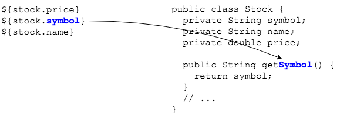

## JavaBean Properties
Using JSP EL to display the `Stock` object calls its `toString()` method.

```html
${stock}

<%-- Stock [symbol=ZTS, name=Zoetis Inc., price=79.73] --%>
```

Use the `.` (dot) operator to access bean properties by name.

```html
${stock.price}
${stock.symbol}
${stock.name}
```

These properties correspond to the Java class's getter methods.




> ### Practice Exercise
> `${stock.price}` is **NOT** referring to the `private double price` field in `Stock`.
> * JSP EL's `.` operator can only look for getter methods.
> * The getter must be named `getPrice()` for `${stock.price}` to work correctly. Similarly, `${stock.symbol}` requires the JavaBean getter `getSymbol()`.

<br >

> ### Drill
> `ExpressionLanguage/src/main/webapp/WEB-INF/select.jsp`
>
> * Change the page to output the stock's properties. Output `symbol` and `value` with bullets.
>
>   ```html
>   name
>   * symbol
>   * price
>   ```
>
> (Solution: _/WEB-INF/solutions/selectProperties.jsp_, _com.example.el.solutions.servlets.StockServletProperties_)

<hr>

[Prev](el-model.md) -- [Up](README.md) -- [Next](el-ops.md)

