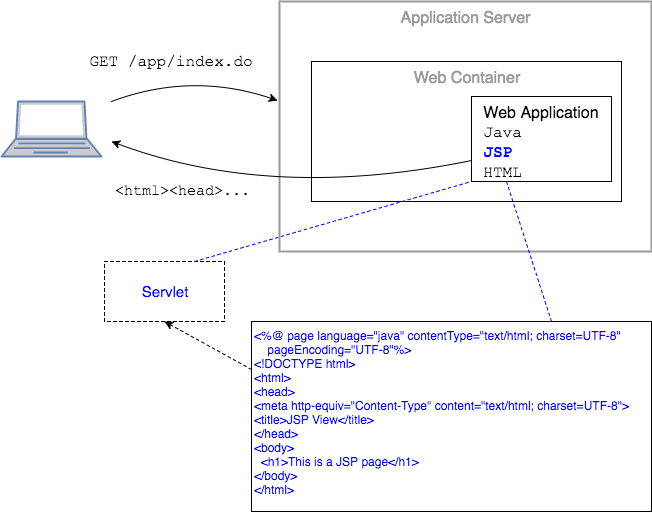

JavaServer Pages, or JSPs, are documents consisting of HTML as well as embedded Java code.
* JSPs allows web developers to create dynamic content by combining HTML with JSP elements.
* Anything within your JSP page that is not a JSP element will be handled by the browser.

Below is a sample JSP page.

```xml
<%@ page language="java" contentType="text/html; charset=UTF-8"
    pageEncoding="UTF-8"%>
<!DOCTYPE html>
<html>
<head>
<meta http-equiv="Content-Type" content="text/html; charset=UTF-8">
<title>JSP View</title>
</head>
<body>
	<h1>This is a JSP page</h1>
</body>
</html>
```

### JSP Processing and Output
JSP files are processed by the web container, not by the client browser.
* The JSP is translated and compiled into a servlet.
* The JSP's purpose is to generate HTML to return to the client - like a servlet does when it writes to the response with `PrintWriter.println`.



> ### Practice Exercise
> JSPs are translated and compiled into servlets _at runtime_.
>
> When a request is made for the JSP's servlet, the web container checks if the JSP's servlet is older than the JSP page itself; if so, it translates the page to a servlet and recompiles into byte code.
>
> Resource: [The Life Cycle of a JSP Page](https://docs.oracle.com/javaee/5/tutorial/doc/bnahe.html)

<hr>

[Prev](README.md) -- [Up](README.md) -- [Next](using-jsp.md)

