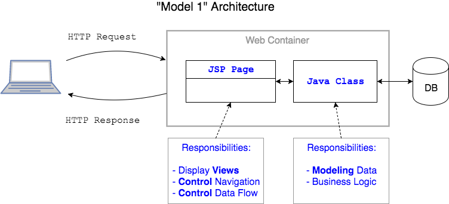
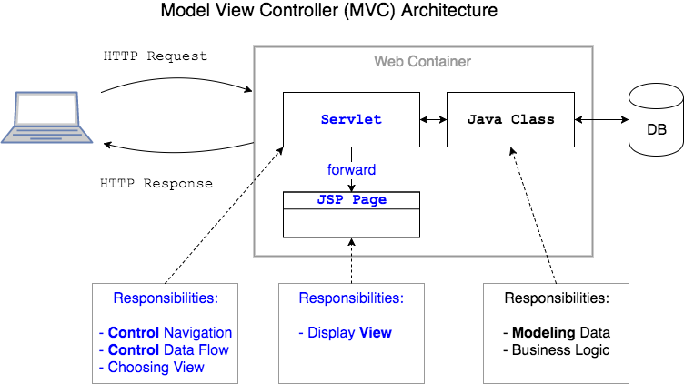

## MVC Design Pattern

### Model 1
Early Java web applications had the JSP as the center of the app. Its responsibilities included:
* Parsing HTTP request parameters.
* Calling classes that perform _business logic_ with _JavaBeans_, which model data.
* Controlling the navigation of the site.
* Controlling what data the user sees.
* Displaying the HTML "view" to the user.

This JSP-centered architecture is known as _Model 1_.

> #### JavaBean
> A Java class with a no-arg constructor and get/set methods.

 

> #### business logic
> Code or processing that handles what happens between the presentation logic (what the user interacts with) and data logic (what the database interacts with).

### Model View Controller (MVC)
Later applications separate the display code (JSP) from flow control (navigation) and interacting with the model (business logic).

A servlet is added to _control_ and coordinate interactions between the _model_ and the _view_.

This three-layered architecture is the _Model-View-Controller_ design pattern.

* _Model_ - JavaBeans, Java classes, and data.
* _View_ - JSP pages; things the user sees.
* _Controller_ - servlet coordinating the model and view.

[Prev](web-inf.md) -- [Up](README.md) -- [Next](labs.md)

