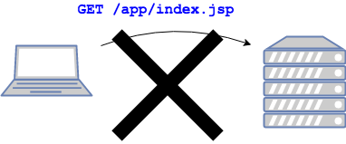
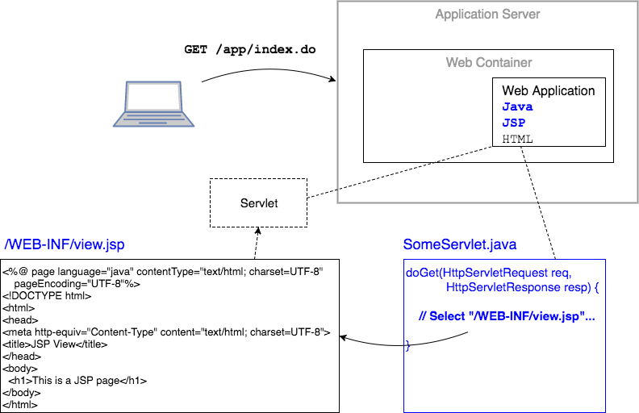

## Using JSP Pages
Users do not request JSP pages the way they would request HTML pages.



Instead, the user requests a URL that is mapped to a servlet, and the servlet chooses the JSP file.



### Selecting the JSP File
Select the JSP file to display to the user by using a `RequestDispatcher` object, which you get from the `HttpServletRequest`.

```java
@Override
protected void doGet(HttpServletRequest req, HttpServletResponse resp) throws ServletException, IOException {

  RequestDispatcher rd = req.getRequestDispatcher("/WEB-INF/view.jsp");

  // ...
}
```

Then call `forward`, passing the original request and response objects.
* The JSP's servlet will now return a response.

```java
@Override
protected void doGet(HttpServletRequest req, HttpServletResponse resp) throws ServletException, IOException {

  RequestDispatcher rd = req.getRequestDispatcher("/WEB-INF/view.jsp");
  rd.forward(req, resp);
}
```

We often do this all in one line.
```java
@Override
protected void doGet(HttpServletRequest req, HttpServletResponse resp) throws ServletException, IOException {
  // RequestDispatcher rd = req.getRequestDispatcher("/WEB-INF/view.jsp");
  // rd.forward(req, resp);
  req.getRequestDispatcher("/WEB-INF/view.jsp").forward(req, resp);
}
```

### Selecting the JSP vs. Writing to the Response
We no longer need to write directly to the response using `PrintWriter.println()`.

```java
@Override
 public void doGet(HttpServletRequest req, HttpServletResponse resp) throws ServletException, IOException {
   // ...

   PrintWriter pw = resp.getWriter();
   pw.println("<html>");
   pw.println("<head><title>Stocks</title></head>");
   pw.print("<body>");
   // ...
   pw.close();
 }
```
* Instead, we just choose a JSP file and forward to it, and it will return its HTML content.
* This is much better than having HTML code in our Java source.


> ### Drill
>
> In this drill you will change a servlet to execute a JSP instead of writing to the response directly.
>
> `JSPViews`
> * Run the project. You will see options on the index page for using two versions of the `StockServlet`. For now, they are the same.
>
> `JSPViews/com.example.jsp.drills.servlets.StockServletJSP`
>
> * Remove the entire contents of `doGet`.
> * Select the view `/WEB-INF/select.jsp` and call `forward`.
> * Run the app. It should look very different.

<hr>

[Prev](jsp-intro.md) -- [Up](README.md) -- [Next](web-inf.md)

