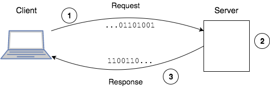
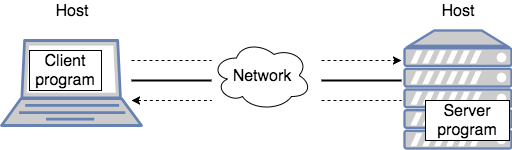

## Clients, Servers, and Hosts

We have seen how web browsers make requests, and web servers return data.
* The browser knows how to read the data and display it as an HTML page.

This is an example of the _client-server model_.

### Client-Server Model

**Clients** request data from a resource or service.

**Servers** are the locations of those resources or services.

The transfer of data, initiated by the client, is called the _request-response cycle_.

1. Client initiates a request.
1. Server processes (handles) the request.
1. Server returns a response.

The client and server are programs running on a _host_.

### Host vs. Server
A _host_ is a device connected to a network.
* It has an address, such as an IP (Internet Protocol) address like `86.75.30.9`.
* A host could be a server, client, or both.

> ### Practice Exercise
> In conversation, when we refer to a "server" we are often describing a remote computer that is both a host (connected to a network) and server (accepts requests from clients).
>
> Though _server_ and _host_ are often used interchangeably, know that a host is a computer connected to a network - a physical device - and a server accepts requests.

### Localhost
In networking, _localhost_ is the name for "this computer."

The name _localhost_ is used by a client (like a web browser) on your computer to access resources from a server running on your computer.

> ### Practice Exercise
> The name _localhost_ usually resolves to the IP address _127.0.0.1_.

[Prev](README.md) | [Up](README.md) | [Next](webapps.md)

