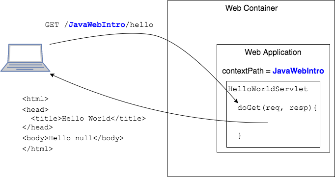
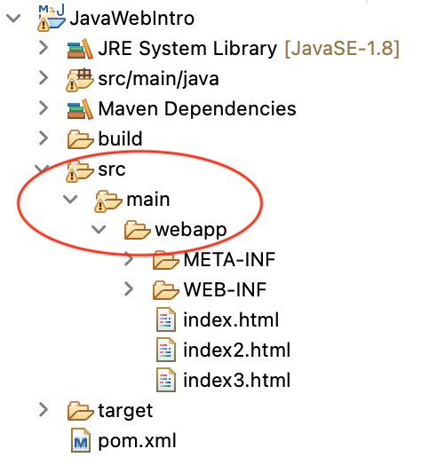
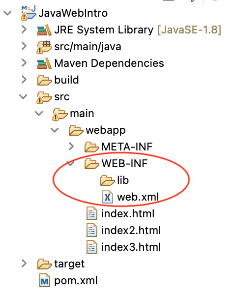
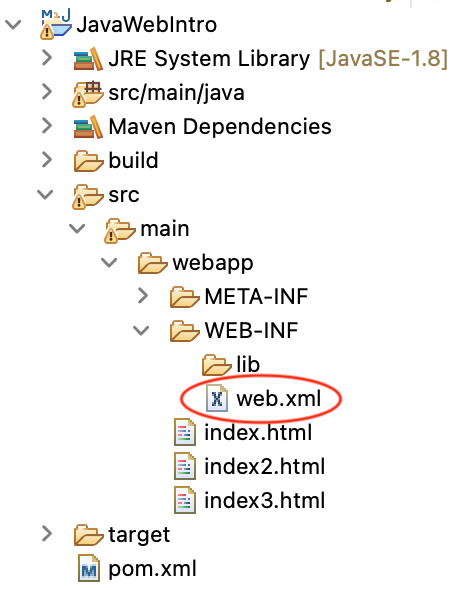
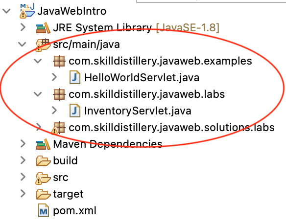

## Web App Path and Structure

### Context Path
Each web application is addressed with a context path.
* To access a component or file in the web application from a browser, you must include the context path in the request URL.

* The context path is determined when the application is deployed.
* A web container can contain a "default" application, which has an empty context path.

You must organize your web application using a specific directory structure.

### Web App Directories

Web content (files users can retrieve in their browsers) by default goes in `src/main/webapp`.

* The web content directory acts as the document root for your application.

  

  * Put your JSP, HTML, and other supporting files here.

  * You can use subdirectories to organize your application.

* Store your application files in a subdirectory named `WEB-INF`.

  

  * Place the `web.xml` configuration file here.

  * `WEB-INF` is not accessible via the web server.

### `web.xml` Deployment Descriptor
`web.xml` is a special file inside `WEB-INF/` which connects the Java Servlet to the Web Container.

### Java Files
In Eclipse, Java files belong in a _Source Folder_, named `src/main/java` by default.

> ### Practice Exercise
> When the application is deployed, class files are copied to `/WEB-INF/classes`. Libraries go in `/WEB-INF/lib`.
>
> _Run As->Run on Server_ deploys the web app to the Tomcat installation directory on your computer.

[Prev](servlet-labs.md) -- [Up](README.md) -- [Next](webxml.md)

