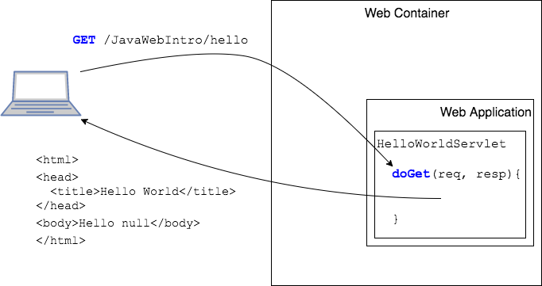
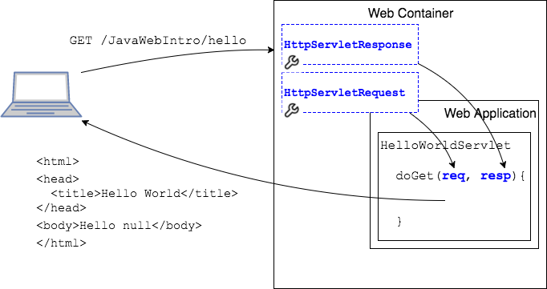
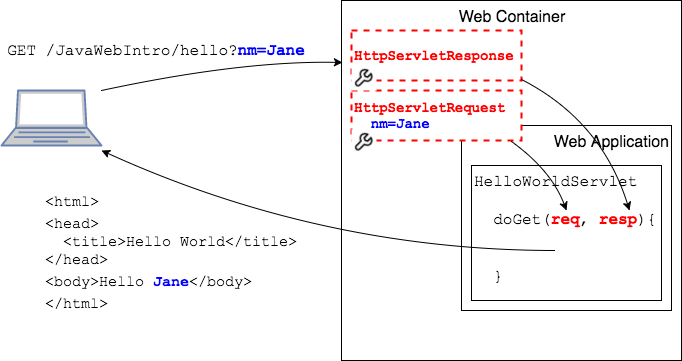

## Java Servlets

A Java Servlet is a class that extends `javax.servlet.http.HttpServlet`.

```java
public class HelloWorldServlet extends HttpServlet {
  @Override
  protected void doGet(HttpServletRequest req, HttpServletResponse resp) throws ServletException, IOException {
    String name = req.getParameter("nm");
    String outputText = "Hello " + name;
    PrintWriter pw = resp.getWriter();
    // HTML text added to response
    pw.println("<html>");
    pw.println("<head><title>Hello World</title></head>");
    pw.println(" <body>" + outputText + "</body>");
    pw.println("</html>");
    pw.close();
  }

  @Override
  protected void doPost(HttpServletRequest req, HttpServletResponse resp) throws ServletException, IOException {
    // Handle POST same as GET
    doGet(req, resp);
  }
}
```

> ### Drill
>
> `JavaWebIntro`
>
> Run this project on Eclipse's Tomcat server by right-clicking the project and selecting _Run As->Run on Server_.


The `HelloWorldServlet` class has two methods for handling requests.

* `doGet(HttpServletRequest req, HttpServletResponse resp)` to handle `GET` requests
* `doPost(HttpServletRequest req, HttpServletResponse resp)` to handle `POST` requests

The Web Container maps a request to either method depending on the type of request.



### `HttpServletRequest` and `HttpServletResponse`

Whether the request is a `GET` or `POST`, the Web Container creates objects that represent the request and response.

* `HttpServletRequest` represents the request and contains any data passed from the user.

* `HttpServletResponse` is created for returning content to the user.





This object creation happens on _every_ request from browser to server.
* If we make a new request with data, new objects are created, and the `HttpServletRequest` contains the data.




> ### Practice Exercise
> The contract between classes like `HttpServlet` and the Web Container is defined by the [Java Servlet Specification](https://javaee.github.io/servlet-spec/).

<hr>

[Prev](java-webapp.md) -- [Up](README.md) -- [Next](servlet-labs.md)

