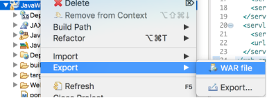
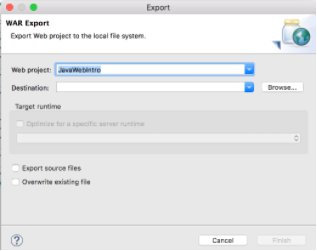

## The WAR File

You can package your application for distribution in a <strong>W</strong>eb <strong>AR</strong>chive (WAR) file.

* A WAR file is a JAR file that contains all of the files in your application.

* Since WAR files must conform to the Java EE specifications, they are portable between different web containers.

### Packaging a WAR File in Eclipse
Packaging a WAR file in Eclipse is simple.

* Right-click the project.
* Choose _Export As_.
* Choose _WAR file_.

This will open a dialog allowing you to select where the WAR file is created.

Note: we do not need to Export a WAR file when deploying to the Tomcat server running on Eclipse. The WAR is for deploying to other servers.

[Prev](labs.md) -- [Up](README.md)

