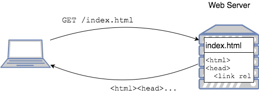
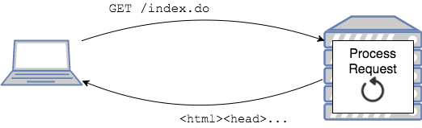
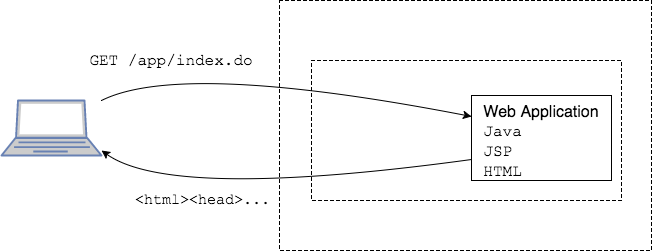
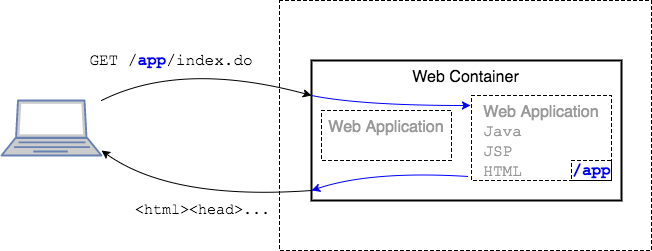
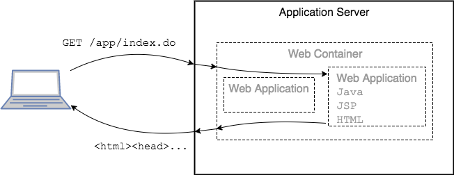

## Web Applications

Client-server requests for _static_ (unchanging) HTML pages are simple.

1. Client requests a page.
2. Web Server returns the contents of the page.

But sometimes we need to process user data or generate the HTML content.

### Dynamic Web Applications
Web applications are programs that the end user can access using a standard web browser.
* In a _dynamic_ web application, we can process user data and create content with Java technologies.

A Java web application is a collection of web components and supporting files, including:
* Java servlets
* JSP files
* Java classes
* HTML pages
* Image files

A web application runs in the environment of a _web container_.

### Web Container
A web container is a program that manages Java web applications. Its responsibilities include:
* Processing requests.
* Mapping requests to specific web applications.
* Returning a response (such as HTML) back to the client.

Below, the Web Container knows requests to `/app` go to a certain Web Application.

### Application Server
The application server runs the Web Container program.

> ### Practice Exercise
> The specifications for Java web applications are defined by the Java Platform Enterprise Edition (Java EE).

[Prev](clients-and-servers.md) -- [Up](README.md) -- [Next](java-webapp.md)

