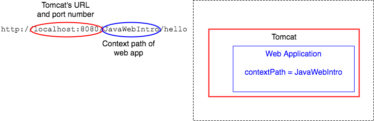
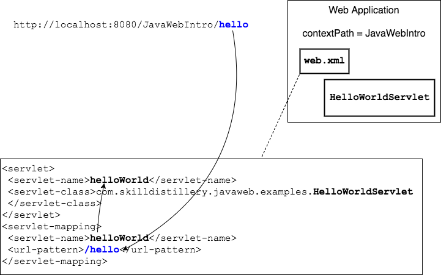

`web.xml` is written in XML, e<strong>X</strong>tensible <strong>M</strong>arkup <strong>L</strong>anguage.

XML is like HTML, but it allows users to define their own customized tags.
* Applications can read these tags and determine what to do with the data based on the tag.


### `web.xml` Explained
Sun Microsystems, the company that owned Java before Oracle, defined the XML tags used in `web.xml`.

```xml
<?xml version="1.0" encoding="UTF-8"?>
<web-app xmlns:xsi="http://www.w3.org/2001/XMLSchema-instance" xmlns="http://java.sun.com/xml/ns/javaee" xsi:schemaLocation="http://java.sun.com/xml/ns/javaee http://java.sun.com/xml/ns/javaee/web-app_3_0.xsd" version="3.0">
  <display-name>JavaWebIntro</display-name>
  <welcome-file-list>
    <welcome-file>index.html</welcome-file>
  </welcome-file-list>
  <servlet>
    <servlet-name>helloWorld</servlet-name>
    <servlet-class>com.example.javaweb.examples.HelloWorldServlet</servlet-class>
  </servlet>
  <servlet-mapping>
    <servlet-name>helloWorld</servlet-name>
    <url-pattern>/hello</url-pattern>
  </servlet-mapping>

  <servlet>
    <servlet-name>inventory</servlet-name>
    <servlet-class>com.example.javaweb.labs.InventoryServlet</servlet-class>
  </servlet>
  <servlet-mapping>
    <servlet-name>inventory</servlet-name>
    <url-pattern>/inventory</url-pattern>
  </servlet-mapping>
</web-app>
```

`<welcome-file-list>` - This is a list of files that will display when the user does not request a particular page. The list is ordered, and the application will display the first file it finds.

`<servlet>` - The servlet is configured here to handle requests.
  * `<servlet-name>` - The servlet has an arbitrary name.
  * `<servlet-class>` - The fully-qualified Java Servlet class.

`<servlet-mapping>` - This tag is how the web container knows to send requests to URLs to a certain servlet class for handling.
  * `<servlet-name>` - this must match the **servlet-name** of a `<servlet>` (above); that is the connection between a Java class and a URL.
  * `<url-pattern>` - this maps a request for a resource to this servlet.
    * For example, to match _all_ requests for resources ending in `.do` to a servlet, use `<url-pattern>*.do</url-pattern>`.


### Example: Following a Request from Page to Servlet

In this example we will examine the link:

```html
<a href="hello">Access Hello Servlet</a>
```

which creates this request:

```
GET http://localhost:8080/JavaWebIntro/hello
```

* `localhost:8080` is the URL for Tomcat.

* `JavaWebIntro` is the context path. This tells Tomcat which web application should try and handle the request.




The requested URL `hello` is mapped to `<url-pattern>/hello</url-pattern>`.
* This pattern is mapped to the servlet named `helloWorld`, which uses the `HelloWorldServlet` Java class.



<hr>

[Prev](configuration.md) -- [Up](README.md) -- [Next](labs.md)

