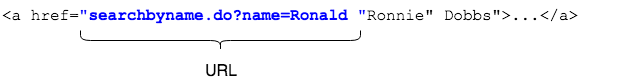
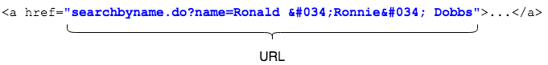

## JSTL - Escaping Data

The simple EL method of outputting data, `${object.member}`, is useful but can fail to display as desired in cases where data must be escaped (quotes, angle brackets, etc.).

```html
<a href="searchbyname.do?name=${student.name }">Find students named ${student.name}</a>
```

In the code above, the link uses a student's name to allow searching for students with similar names.
* The link is broken if a student has double quotes in their name, such as `Ronald "Ronnie" Dobbs`.

```html
<a href="searchbyname.do?name=Ronald "Ronnie" Dobbs">Find students named Ronald "Ronnie" Dobbs</a>
```



### JSTL Core `<c:out>`
Escape data using the JSTL Core tag library `out` tag, `<c:out value=""/>`.

```xml
<a href="searchbyname.do?name=<c:out value="${student.name }"/>">Find... </a>
```
* Note how the EL token is the `value` of the `c:out` tag. This will "escape" characters so they can be safely displayed on by the browser.

```html
<a href="searchbyname.do?name=Ronald &#034;Ronnie&#034; Dobbs">Find...</a>
```




> ### Practice Exercise
> Escaping data is especially important when echoing user-entered data (such as data collected with form fields) to the screen. Not doing so leaves the site open to <a href="https://www.owasp.org/index.php/Cross-site_Scripting_(XSS)">Cross-site Scripting (XSS)</a> attacks.

<hr>

[Prev](formatting.md) -- [Up](README.md) -- [Next](labs.md)

