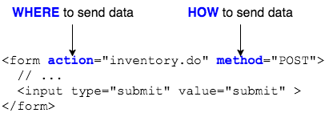

An HTML form provides a mechanism for accepting user input in a browser and, when activated, generating and sending a query request to the web server.

```html
<form action="inventory.do" method="POST">
	<h2>Enter data into the form and examine it with Developer Tools:</h2>
	<label for="search">Search:</label> <input type="text" name="search">
	<br >
	<label for="comments">Comments:</label> <input type="text" name="comments">
	<br >
	<input type="submit" value="submit" >
</form>
```

* `action` - the location where the form will send data.

* `method` - the type of submission: `GET`, `POST`.





### Form Elements
Each form element has a `name` and a _value_.
  * An element can have multiple values.
  * The browser sends each element's name and value to the server when the form is activated (submitted).
  * The server passes these *name=value* pairs to the server-side program designated by the form's `action`.

### Form Submission
An HTML form needs an element that will activate it, causing the browser to transmit the user's input to the server.
 * The most obvious and traditional example is a Submit button.

   ```html
   <input type='submit' value='Click Me'>
   ```
   * A form's first Submit button is its default button.
     * Hitting Enter in the browser triggers the default button.

 Activating the form causes the browser to:
 * Concatenate the form element names and current values into a properly encoded CGI query string.

 * Send the specified HTTP method request to the specified action URL:

   * `GET`: Append the query string to the URL, following a question mark `?`.
   * `POST`: Send the query string as the request body.


### Example `POST` and Response

```
POST /char.cgi HTTP/1.1
Host: example.com
Connection: keep-alive
Content-Length: 179
Cache-Control: max-age=0
Accept: text/html,application/xhtml+xml,application/xml;q=0.9,image/
webp,*/*;q=0.8
Origin: null
User-Agent: Mozilla/5.0 (X11; Linux x86_64) AppleWebKit/537.36 (KHTML, like Gecko) Chrome/40.0.2214.91 Safari/537.36
Content-Type: application/x-www-form-urlencoded
Accept-Encoding: gzip, deflate
Accept-Language: en-US,en;q=0.8

character_name=Glorb&character_type=Zombie&inclination=neutral&attitude=
nasty&power=Summon+vermin&power=Bad+Breath&catchphrase=GLURRGGGHH%21&pla
yer_level=1&create_character=Create

HTTP/1.1 200 OK
Connection: close
Content-type: text/plain
Content-length: 18

Character created.
```


> ### Drill
>
> * Open a Chrome browser and enter the URL `http://localhost:8080/WebData/form.html`.
>   * Open the _Developer Toolbar_ and select the _Network_ tab.
> * Submit the form and examine the request headers and body.
>
> `WebData/src/main/webapp/form.html`
>
> * Change the `form`'s method to `GET`.
>   * Refresh the page and resubmit the form. What changed?
> * Change the `form`'s method to `get`.
>   * Refresh the page and resubmit the form. Did anything change?
>
> (Solution: _http://localhost:8080/WebData/solutions/formGET.html_)

<hr>

[Prev](request-data.md) -- [Up](README.md) -- [Next](get-vs-post.md)

