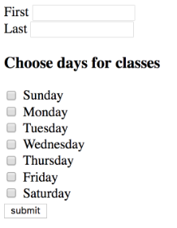
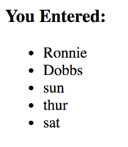

## Labs

In this lab you will create a Dynamic Web Project with a form to submit data, and a servlet to handle that data and return a response.

1. Create a new Dynamic Web Project called _WebDataLabs_. Make sure to have Eclipse generate the `web.xml`.

1. Convert the project to a Maven Project and add the servlet dependency to `pom.xml`.

   ```xml
   <dependencies>
     <dependency>
      <groupId>javax.servlet</groupId>
      <artifactId>javax.servlet-api</artifactId>
      <version>3.1.0</version>
      <scope>provided</scope>
     </dependency>
   </dependencies>
   ```

1. In `src/main/webapp/`, create an HTML page `userdata.html`.
   * Create a form that submits a `POST` request to `userdata`.
   * Add text fields for `firstName` and `lastName`.
   * Add checkbox fields allowing the user to select days of the week for class. Name the checkbox input whatever you want (`day`, for example).

     

   (Solution: _WebDataLabsSolution/src/main/webapp/userdata.html_)

1. Create a class in the package `com.example.webdata.servlets` called `UserDataServlet`. It must extend `javax.servlet.http.HttpServlet` and override `doPost()`.
   * Get the values for each field (or set of fields).
   * Use `PrintWriter` to create an HTML response that displays the values back to the user. Style this however you choose.

     

   (Solution: _WebDataLabsSolution/com.example.webdata.servlets.UserDataServlet_)

1. In `web.xml`
   * Change the `<welcome-file-list>` to use your `userdata.html` page as the only `<welcome-file>`.
   * Add a `<servlet>` for your `com.example.webdata.servlets.UserDataServlet` class.
   * Add a `<servlet-mapping>` mapping for the url `/userdata` so that it uses your servlet.

   (Solution: _/WebDataLabsSolution/src/main/webapp/WEB-INF/web.xml_)

1. Test your application. Be sure to test for the case where the user does not select any days.

1. (Optional) Test using the value below in one of your text fields:

   ```html
   <script>alert("Malice!");</script>
   ```

1. (Optional) Add a field to your HTML form for `age`. Have the servlet add a message to the response if the user is over 21.
   * Test with the value `A`.

<hr>

[Prev](servlet-data.md) -- [Up](README.md) -- [Next](2-labs.md)

