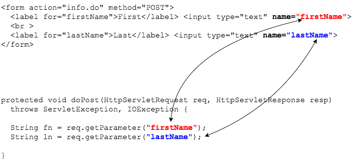

## Using Data in Servlets

The `HttpServletRequest` gives you information about the request, including the data passed in a query string or form.


### `String getParameter(String)`
We can access form data with the `getParameter` method.

The form below will submit `firstName` and `lastName` to the server.

```html
<form action="info.do" method="POST">
	<label for="firstName">First</label> <input type="text" name="firstName">
	<br >
	<label for="lastName">Last</label> <input type="text" name="lastName">
</form>
```

The servlet's `doPost()` method retrieves each parameter's value by calling `getParameter(paramName)`.

```java
protected void doPost(HttpServletRequest req, HttpServletResponse resp) throws ServletException, IOException {
  // ...

  String fn = req.getParameter("firstName");
  String ln = req.getParameter("lastName");

  // ...
}
```

The connection between the form's `input` and the servlet's call to `getParameter` is important to note.
* The `input`'s `name` is the key `getParameter()` can use to access the data value.



### Checkbox Data - `getParameterValues`
HTML checkboxes send data to the servlet in the format `key=value1&key=value2`.

For example, this input

```html
<h3>Choose your interests</h3>
<div>
  <input type="checkbox" id="coding" name="interest" value="coding">
  <label for="coding">Coding</label>
</div>
<div>
  <input type="checkbox" id="animals" name="interest" value="animals">
  <label for="animals">Animals</label>
</div>
<div>
  <input type="checkbox" id="presidents" name="interest" value="presidents">
  <label for="presidents">Presidents</label>
</div>
```

can send three values for `input name="interest"`.

```
interest=coding&interest=animals&interest=presidents
```

Use `String[] getParameterValues(String)` to get the values as an array.

```java
String[] interests = req.getParameterValues("interest");

// [coding, animals, presidents]
```

This method returns `null` if the parameter does not exist in the request.

```java
String[] nope = req.getParameterValues("interestssss");

// null
```

> ### Practice Exercise
> `getParameter` and `getParameterValues` always return `String` data, so if you need an `int`, for example, you have to parse each `String` and handle any exceptions.

<hr>

[Prev](status-codes.md) -- [Up](README.md) -- [Next](labs.md)

