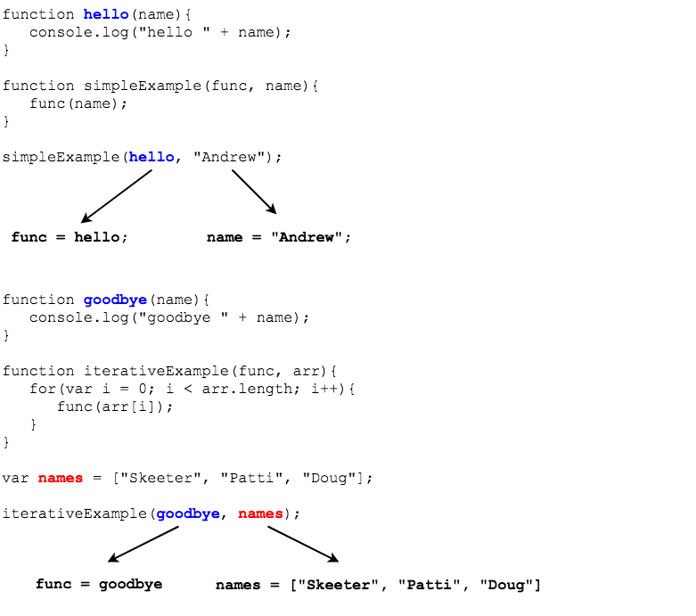

> #### higher order function
> A function that takes a function as an argument or returns a function as a result.

***Consider this code block***:

```js
let nums = [1,2,3,4,5];

function printSquare(number, index) {
  console.log(number * number);
};

nums.forEach = function() {
  for (let i = 0 ; i < this.length ; i++) {
    printSquare(this[i], i);
  }
};

nums.forEach();

```

The above function (`nums.forEach`) will use the function `printSquare` to print out the squared value of the current value being iterated over in the array.

* This `forEach` method is not very useful as it is bound to use one specific function implementation (`printSquare`).

### Dynamically Altering Behavior by Providing Functions as Arguments

In the following example, instead of always using the same function, we will use a function provided when the `forEach` method is invoked.
* This will make our method much more dynamic and allow the end user to specify how it be implemented.

```js
let nums = [1,2,3,4,5];

nums.forEach = function(providedFunc) {
  for (let i = 0 ; i < this.length ; i++) {
    providedFunc(this[i], i , this);
  }
};

function printSquare (number, index, array) {
  console.log(number * number);
}

function printSum (number, index, array) {
  console.log(number + number);
}

function isEven (number, index, array) {
  console.log(number % 2 === 0);
}

nums.forEach(printSquare);
nums.forEach(printSum);
nums.forEach(isEven);
```

We have never seen behavior like this before. 
* Because functions are considered 'values', no different than a number, string, or object, they can be passed to functions and used in a similar fashion.

 ### Skill Drill
1. When we define a function and print the value of the assigned name, what do we get?

    ```javascript
    function example1 (){
      console.log("example1");
    }

    console.log(example1);  

    // or

    let example2 = function(){
      console.log("example2");
    }
    console.log(example2);
    ```

1. This would have given us an error in Java. But in JavaScript, even an uninvoked function still has a value, its assigned function. We can store this value into other variables if we want to.

    ```js
      let example2 = function(){
        console.log("example2");
      }

      let test = example2;
      console.log(test);
      test();
    ```

1. This is essentially what happens when we pass a function as an argument to another function. The provided function is assigned to the function's parameter, which we can use from within the function.

    

<hr>

[Prev](scope.md) -- [Up](README.md) -- [Next](arrowFunctions.md)

