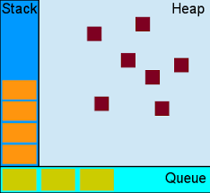

Unlike many other C based languages, JavaScript is single-threaded. While multi-threading is possible, it usually isn't necessary despite JavaScript's thorough use of async functions. This is made possible by a unique runtime environment involving something called the 'Event Loop'.

This is a visual representation of the JavaScript runtime:

  

Let's investigate some of the terms depicted in this image (and one that isn't):
  * **Heap** = where memory allocation happens.
  * **Stack** = data structure which keeps track of current values in a series of processes. When a function is invoked, the function calls which compose it are added to the stack, and then removed as they return. A 'stack overflow' occurs when too many processes are added to the call stack without being returned...like an endless recursive function.
  * **Queue** = functions and processes waiting to be added to the stack and executed.
  * **Event Loop** (not depicted) = prioritizes functions in the queue to be added to the stack.
  * **Callbacks** (or callback functions) = are functions that will be executed after another process completes, usually when a resource has become available after an operation.

This runtime allows function calls to 'run-to-completion' and clear the stack quickly, making room for the next function to be taken from the queue and resolved without holding up the program (known as 'blocking').

**'blocking'** = synchronous functions are blocking, no other processes can execute while a synchronous function is blocking the call stack. This is particularly problematic for client-side JavaScript, because while a process is waiting to be returned, none of the browser events can fire. This means that all browser events will appear to be non-functional and users will wonder why nothing happens when they click on a button.

**'non-blocking'** (or 'never-blocking') = asynchronous functions are said to be non-blocking. Instead of waiting for their task to complete and then executing some other task, async functions make a request, assign something called a callback function to that request, and then clear the stack...allowing another task to be added to the stack and so on.

[Prev](asynchronicity.md) | [Up](README.md) | [Next](jsFunctionLifeCycle.md)

