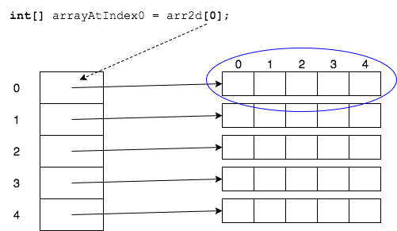
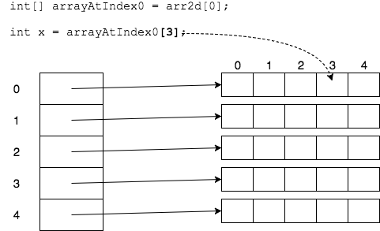
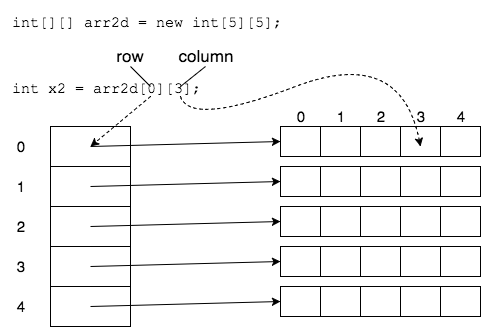
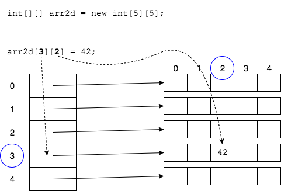

To access the elements of a two-dimensional array, we first tell Java which array we mean.
```java
int[][] arr2d = new int[5][5];

int[] arrayAtIndex0 = arr2d[0];
```



After telling Java which array, we can use another `[]` to say which element.

```java
int x = arrayAtIndex0[3];
```



We are telling Java which _row_ and _column_ we want.

* We can access elements in one statement.

```java
int[][] arr2d = new int[5][5];
int x2 = arr2d[0][3];
```



### Practice Exercise
Think of 2-d arrays in terms of "row" and "column", not _x_ and _y_ coordinates.

### Assigning Elements
Assigning elements is simple - just tell Java which row and column you want.

```java
int[][] arr2d = new int[5][5];
arr2d[3][2] = 42;
```


### Drill
`AdvancedArrays/com.example.advancedarrays.drills.MultiDeclare`
* Fill the multi-dimensional array as directed.

<hr>

[Prev](arrays-of-arrays.md) -- [Up](README.md) -- [Next](for.md)

