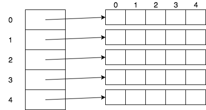

Since arrays themselves are objects, we can have arrays of arrays.



When we first started making arrays, we added a single `[]` to a variable name to tell Java it was an array.

```java
int[] arr = new int[5]; // array of 5 ints
```
To make arrays of arrays, we add another `[]`.

```java
int[][] arr2d = new int[5][5]; // array of 5 arrays of 5 ints
```
We call these arrays of arrays _multidimensional arrays_.

* A multidimensional array with two `[]`s would be called a _two-dimensional_ array.


### Practice Exercise
The total number of square brackets in the declaration determines the number of dimensions for each array.
```java
// Each of these declares a two-dimensional array of ints:
int[][] a2d1;
int[]   a2d2[];
int     a2d3[][];

// Not great style, but legal:
int[] oned, twod[], threed[][];
```

<hr>

[Prev](returning-arrays.md) -- [Up](README.md) -- [Next](accessing.md)

