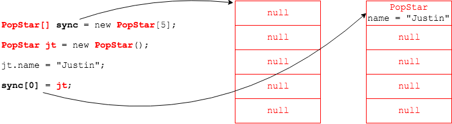

## Array Syntax

We use the `[]` operator to declare array variables, and the `new` operator to create an array object.
```java
// array of ints
int[] intArr = new int[5];
```

We can also have arrays of objects.
```java
// array of String objects
String stringArr[] = {"Danny", "Donnie", "Joey", "Jon", "Jordan"};
```


Any objects.
```java
public class PopStar {
  public String name;
  public void sing() {
    // ...
  }
}

// array of PopStar objects
PopStar[] sync = new PopStar[5];
```



### Drill
`AdvancedArrays/com.example.advancedarrays.drills.ArrayOfObjects`
* Update the `PopStar` class according to the instructions.
* Update `ArrayOfObjects` according to instructions.

<hr>

[Prev](README.md) -- [Up](README.md) -- [Next](returning-arrays.md)

