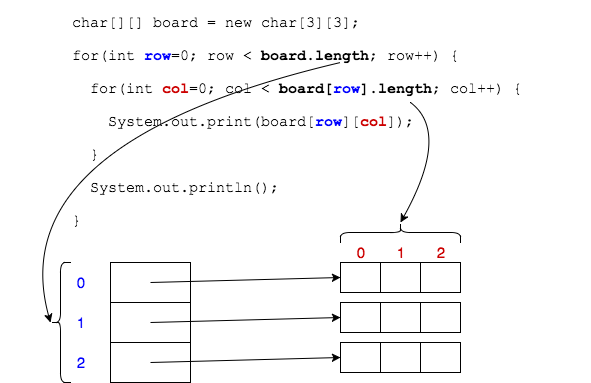
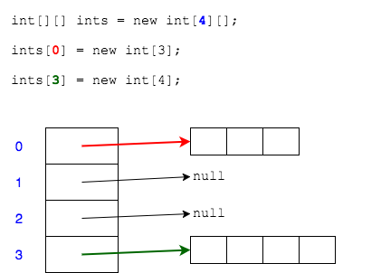

## Iterating Multidimensional Arrays

We iterate multidimensional arrays with nested `for` loops.

```java
char[][] board = new char[3][3];
for(int row=0; row < board.length; row++) {
  for(int col=0; col < board[row].length; col++) {
    System.out.print(board[row][col]);
  }
  System.out.println();
}
```
The outer `for` loop iterates the rows.

The inner `for` loop iterates the columns (for each row).



### Practice Exercise
Multidimensional arrays do not have to be rectangular. Each array could be a different length.

In fact, we are only required to give the dimension of the first index when creating the array.
```java
int[][] ints = new int[4][];
   
ints[0] = new int[3];
ints[3] = new int[4];
```


<br >

### Drill
`AdvancedArrays/com.example.advancedarrays.drills.MultiDeclare`
* Add a method called `printBoard` to iterate through the tic-tac-toe board. Its one parameter is a 2-d array of `char`s, same as your tic-tac-toe board.
* Call the method in `main` to print your board.

(Solution: _MultiDeclare2.java_)

<hr>

[Prev](accessing.md) -- [Up](README.md) -- [Next](foreach.md)

